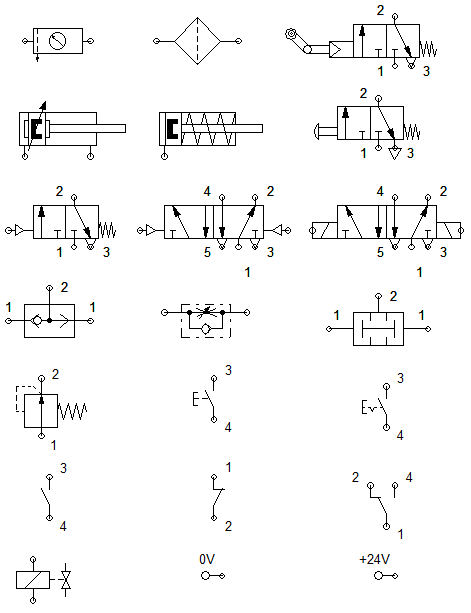

# Ejercicios del capítulo 2

1. Cuál es la función general de un cilindro; es decir, ¿cómo es la conversión de energía?
2. A qué se le llama carrera de avance y retroceso
3. Dibujar el cilindro de simple efecto e indicar sus partes
4. Mencione al menos 2 tipos de accionamiento de las válvulas
5. Cómo es la operación de una válvula check o antetirretorno
6. Describa la estructura de un sistema neumático
7. Explique cómo está operando el siguiente circuito detalladamente; es decir, qué está realizando cada elemento en cada momento

1. Indicar el nombre completo de los siguientes símbolos

---

- [Inicio](../index.md)
- [Capítulo 1](../capitulo1/index.md)
- [Capítulo 2](./index.md)
- [Capítulo 3](../capitulo3/index.md)
- [Capítulo 4](../capitulo4/index.md)
- [Bibliografía](../bibliografia.md)
