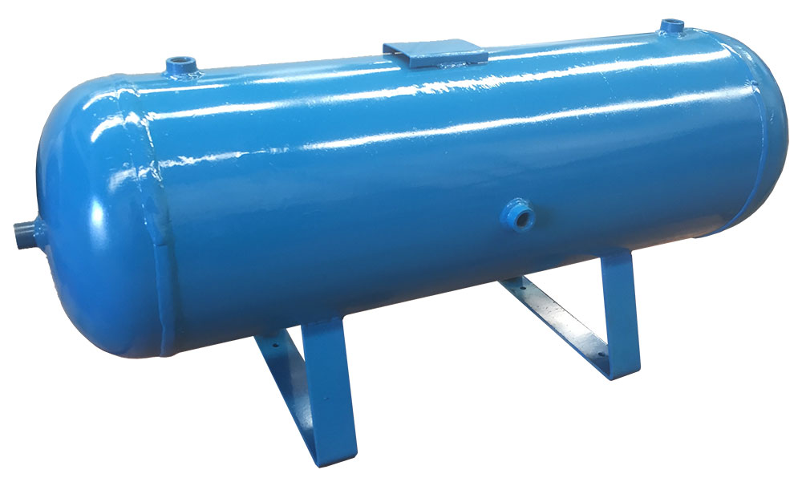
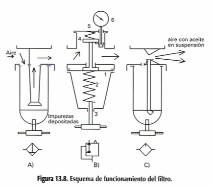
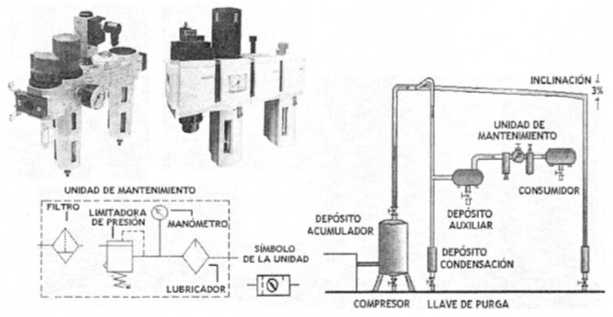
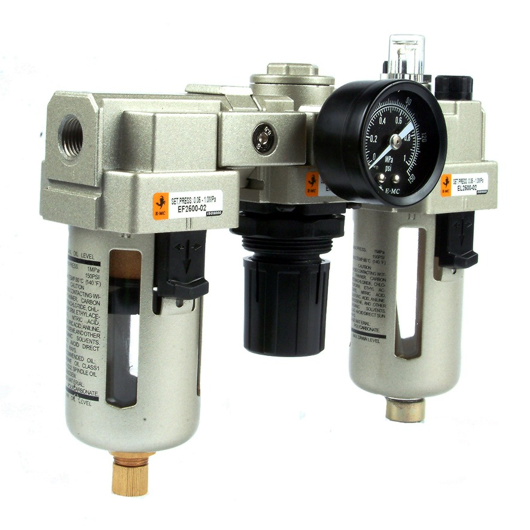

# Capítulo 2. Neumática

## Características del aire comprimido

El aire, como todos los gases, es comprimible y comprensible; es decir, es elástico. Dentro de un recipiente con capacidad de 1 litro, es posible introducir varios litros de aire gracias a que se puede comprimir y al liberarlo, vuelve a su volumen normal.

Para comprimir el aire, se tiene que realizar un esfuerzo y será mayor cuanto mayor se quiera comprimir. Cuando el aire se libera a su estado normal, desarrolla una gran energía y es esta energía la que se utiliza para realizar los trabajos pesados.

El aire, como se sabe, es un gas casi perfectamente caracterizándose esencialmente por su **fluidez, compresibilidad y elasticidad**. La fluidez permite a sus partículas no ofrecer resistencia apenas al deslizamiento; la compresibilidad (Fig. 1.1) hace que una determinada cantidad de gas pueda reducir su volumen si este se encuentra en un recinto herméticamente cerrado; la elasticidad permite que al comprimirlo en ese mismo recinto, ejerza sobre sus paredes una determinada presión, normal a las superficies en contacto (Fig. 1.2).

### Unidades empleadas y equivalencias

$$1 atm = 14.7 psi =1,013 bar = 101.325kPa$$

$$ 1N/m^2 = 9.869 \times 10^{-6} atm = 10^{-5} bar$$

## Sistema de compresión de aire

### Compresor

Los compresores son máquinas que se utilizan para comprimir el aire. El más elemental es el compresor alternativo, pero para aplicaciones industriales se construyen máquinas autónomas que utilizan un motor eléctrico y que se denominan electrocompresores.

> Es el elemento de la instalación encargado de comprimir el aire que capta de la atmósfera elevando su presión.

Se compone de un cilindro y su culata con las correspondientes válvulas, una de admisión y otra de expulsión; un pistón provisto de segmentos para asegurar la compresión; una biela manivela (*conversión de un movimiento circular en rectilíneo alternativo*) y un cigüeñal. Todo montado en un cárter que, a su vez, hace de depósito para el aceite lubricante.

### Tipos de compresores

Dependiendo del tipo de compresor que utilicemos distinguimos varios tipos.

- Compresores Volumétricos.
- Compresores Centrífugos.

#### Compresores Volumétricos

Dentro de este grupo destacan los compresores de pistón, que son los más difundidos. Se construyen de baja, media y alta presión, aunque en este caso deben disponer de varias etapas compresoras.

#### Compresor de pistón de una sola etapa

La Figura 13.2 muestra un compresor de pistón clásico de una sola etapa. El aire aspirado por el pistón en su carrera des­cendente penetra en la cámara de compresión a través de la válvula de admisión y después es inmediatamente comprimido hasta la presión de trabajo, momento en el que se abre la válvula de escape. Durante el trabajo de compresión se genera calor *según previene la ley de Gay-Lussac* lo que obli­ga a una refrigeración del cilindro proporcional a la cantidad de calor producida. En los compresores pequeños bastan las aletas que lleva el cilindro por la parte exterior. En los mayo­res se instala además un ventilador y en los de alta presión es necesaria la refrigeración por agua.

#### Animación del compresor

### Compresor de pistón 2 etapas montaje en V

En la Figura 13.3 aparece un compresor de pistón de dos etapas y montaje en V. El aire comprimido en el primer pistón, después de refrigerado, se introduce en un segundo cilindro de volumen inferior que lo vuelve a comprimir. Así se obtienen presiones de 1 a 20 bar y con tres etapas se puede llegar hasta 220 bar.

### Compresores Centrífugos

Se basan en aumentar la presión aprovechando la fuerza centrífuga. Para ello, lanzan el aire captado por el centro de una turbina hacia el exterior, donde lo recogen.
De este tipo son la mayoría de los extractores de aire que tienen las campanas extractoras de las cocinas.

## El tanque o unidad de almacenamiento

Es un depósito de reserva de aire comprimido cuya misión es mantener el consumo de la red y evitar pérdidas de carga bruscas en la misma, en caso de fallo o accidente. En este elemento se elimina parte del agua  -que se condensa en su parte inferior- por medio de un orificio de purga.

Cumple varias funciones en una instalación de aire comprimido:

- Amortiguar las pulsaciones del caudal de salida de los compresores alternativos.
- Permitir que los motores de arrastre de los compresores no tengan que trabajar de manera continua, sino intermitente.
- Hacer frente a las demandas punta de caudal sin que se provoquen caídas de presión en la red.

## Presostato (Switch de presión)

Si has observado los compresores no están funcionando continuamente. Esto es debido a que es posible acumular la energía neumática. El depósito se va a llenar hasta que alcance una determinada presión máxima, en ese momento el motor que acciona el compresor para. A medida que vamos consumiendo aire vamos extrayéndolo del depósito, con lo cual va bajando su presión. Al llegar a una presión mínima el compresor vuelve a arrancar para recuperar la presión perdida.
Vemos que el depósito varía entre un valor máximo y uno mínimo. El elemento que mide esas presiones y regula el funcionamiento del compresor es el presostato. **Básicamente, es un interruptor regulado por presión**.

## Válvula de Seguridad

Si por alguna razón el presostato que regula el funcionamiento del compresor fallase, pueden ocurrir dos cosas.
Si falla el mecanismo que regula el arranque cuando baja la presión, el compresor no funcionaría, pero no pasaría nada más.
Si falla el mecanismo de paro cuando alcanza la presión de trabajo, el compresor continuaría aumentando la presión en el interior del depósito y este podría estallar al no aguantar a presión.

## Válvula de purga

Debido a las presiones a las que es sometido el aire durante la compresión, parte del vapor de agua que contiene el aire puede licuar. Esta agua condensada se acumula en la parte inferior del depósito y periódicamente hay que purgar para evitar que pase a la instalación.

## Unidad de Mantenimiento

Hasta ahora lo que hemos hecho ha sido comprimir el aire y almacenarlo para poder utilizarlo. El almacenamiento se realiza, como hemos visto, entre dos presiones determinadas. Estas variaciones perturbarían el funcionamiento de la instalación, ya que funcionaría de manera distinta para cada presión. Es por ello que debemos realizar un acondicionamiento final que estabilice esa presión en un valor fijo. Este acondicionamiento es lo que hacemos en la unidad de mantenimiento.

*Para la utilización del aire comprimido, se requiere de un proceso de purificación, regulación y engrase*, que se logra mediante una unidad de mantenimiento, que debe ir montada en la entrada general de los circuitos neumáticos. Esta unidad tiene los siguientes objetivos:

- Eliminar el agua condensada arrastrada por el aire a lo largo de las tuberías hacia los elementos de trabajo y dispositivos de mando.
- Detener las partículas sólidas que contiene el aire comprimido en suspensión.
- Regular la presión de utilización del aire comprimido con el fin de lubricar los elementos neumáticos.

Así que la unidad de mantenimiento representa una combinación de los siguientes elementos:

- Filtro de aire comprimido
- Regulador de presión
- Lubricador de aire comprimido

### Filtro

Su misión es retener las impurezas que pudiera contener el aire procedente del depósito y que podrían deteriorar la instalación posterior.
Está formado por un elemento filtrante, que puede ser de papel, una chapa metálica taladrada o una malla de alambre, encargado de retener las impurezas. Aquí quedan retenidas las partículas de tamaño mayor que las de la malla.
El recipiente del filtro tiene también un diseño especial para que el aire en su recorrido realice un movimiento helicoidal que favorece que por efecto de las fuerzas centrífugas las gotas de agua y las partículas más grandes salgan proyectadas contra las paredes del filtro y sean recogidas en la parte inferior del filtro. Esta parte inferior del filtro es desmontable y periódicamente es necesario limpiarla.

### Regulador de presión

Mantiene la presión en su salida constante independientemente de las variaciones de presión que haya en la entrada. La presión de salida tiene que ser siempre inferior a la presión mínima del depósito.
Como vemos en la imagen el aire pasa a través de un orificio y mediante una membrana vence la fuerza de un muelle, dependiendo de la presión la fuerza es mayor o menor mientras que la del muelle es constante. Esto provoca la mayor o menor apertura del orificio de paso, haciendo que la presión se mantenga constante aguas abajo.

### Lubricador

Es el elemento que proporciona aceite para la lubricación de la instalación. Debido al efecto Venturi absorbe aceite de un depósito y lo pulveriza en el aire de trabajo. El aceite lo añadimos para reducir rozamientos en los elementos móviles de la instalación y proteger toda ella de la oxidación.
En este punto tendremos una caudal de aire a presión en condiciones de abastecer nuestra instalación a presión constante.

## Manómetro

Los manómetros son aparatos de control que sirven para medir la presión existente en un circuito en un momento dado.
La presión P del circuito tiende a rectificar el muelle tubular (2), el cual mueve el sector (4) que hace girar el piñón (5) unido a la aguja indicadora (6). En la escala (7) puede leerse entonces la presión registrada. La caña (10) del aparato lleva un estrangulador (8) que amortigua el impacto de la presión sobre la aguja.

---

## [Ejercicios del Capítulo 2](./ejercicios2.md)

---

- [Inicio](../index.md)
- [Capítulo 1](../capitulo1/index.md)
- [Capítulo 2](#capítulo-2-neumática)
- [Capítulo 3](../capitulo3/index.md)
- [Capítulo 4](../capitulo4/index.md)
- [Bibliografía](../bibliografia.md)
