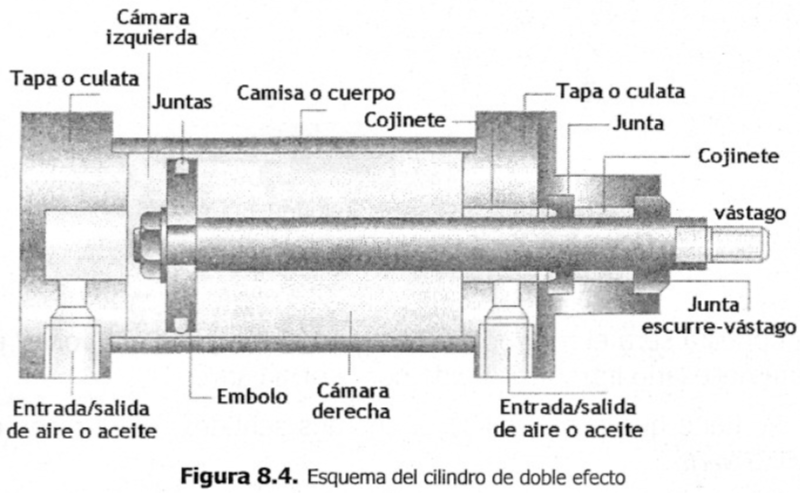

# Capítulo 3. Elementos neumáticos

Para un funcionamiento óptimo, la presión de funcionamiento del sistema de control deberá ser de máximo P=500kPa = 5 bar con aire sin lubricar.

## Cilindros

*Los cilindros neumáticos son, por regla general, los elementos que realizan el trabajo. Su función es la de transformar la energía neumática en trabajo mecánico de movimiento rectilíneo, que consta de carrera de avance y carrera de retroceso.*

De acuerdo a esta teoría física, si dentro del sistema se presenta una diferencia de áreas y la fuerza es igual en cualquier punto, entonces se tendrá una diferencia de presiones. Este principio se aplica en un dispositivo hidráulico denominado cilindro.

- Tubo de sección circular constante, cerrado por sus extremos
- En su interior se desliza un émbolo solidario con un vástago
- El émbolo divide al cilindro en dos volúmenes llamados cámaras
- Hay una abertura en cada cámara para que entre y salga el aire.

**Capacidad de trabajo:**

- **Carrera:** **Desplazamiento que efectúa el émbolo en el interior del cilindro**. De ella depende la **Longitud (L)** de desplazamiento del vástago.
  - En los cilindros se obtiene el máximo esfuerzo cuando **la presión se ejerce sobre la cara del émbolo opuesta al vástago**, ya que su superficie es mayor. En este caso el émbolo y el vástago realizan una **CARRERA DE AVANCE**.
  - **CARRERA DE RETROCESO**: **Si la presión se ejerce sobre la cara del émbolo solidaria con el vástago**.
- **Diámetro (D):** Determina la superficie del émbolo. Dada una determinada presión del aire, cuanto mayor sea la
superficie del émbolo, mayor será la fuerza que ejerce el vástago, ya que:

### Cilindro de simple efecto con retorno de muelle

**Estos cilindros tienen una sola conexión de aire. No pueden realizar trabajos más que en un sentido. Entonces para que el vástago (o pistón) salga se aplica el aire y para que el vástago retorne se dispone de un muelle incorporado o de una fuerza externa.**
El muelle incorporado se calcula de modo que haga regresar el émbolo a su posición inicial a una velocidad suficientemente grande.
En los cilindros de simple efecto con muelle incorporado, su longitud limita la carrera (el desplazamiento efectivo del vástago). Por eso, estos cilindros no sobrepasan una carrera de unos 100mm.
Se utilizan principalmente para sujetar, expulsar, apretar, levantar, alimentar, etc.
En la figura 8.1 se ilustra un esquema de la estructura interna, indicando las partes que lo componen. Como se observa en la figura, el fluido (aire o aceite) entra por la cámara izquierda y empuja al émbolo venciendo la resistencia del muelle haciendo que el vástago salga.

La figura 8.3 muestra el símbolo del cilindro de simple efecto. En la figura se tiene:

- (A) Cilindro de simple efecto con retorno por acción de fuerza externa
- (B) Cilindro de simple efecto con retorno por muelle
- (C) Inyecta fluido en la cámara izquierda del cilindro; las flechas indican que por efecto del fluido se ejerce una fuerza sobre el émbolo empujando el sistema hacia la derecha.

### Cilindro de doble efecto

#### Son los más empleados y el fluido actúa en ambas cámaras

**La fuerza ejercida por el fluido en cilindros de doble efecto, permite que el vástago pueda realizar un movimiento de traslación en los dos sentidos.** Se dispone de una fuerza útil tanto en la ida como en el retorno. La figura 8.4 muestra un esquema interno del cilindro. Para que el vástago se desplace en ambas direcciones es necesario que una de las cámaras esté alimentada y la otra esté en estado de escape (para el aire) o tanque (para el aceite)

Los cilindros de doble efecto comparados con los de simple efecto presentan algunas ventajas:

1. Pueden realizar esfuerzos en ambas cámaras.
2. Las carreras son mayores, pues se aprovecha prácticamente toda la longitud del cuerpo del cilindro.
3. No necesita de esfuerzo para comprimir un muelle por no tenerlo.
4. El retroceso del vástago no depende de las cargas o elementos mecánicos.
5. El funcionamiento y su posicionamiento se pueden ajustar con mayor precisión.

## Válvulas distribuidoras

Son muy similares para los circuitos neumáticos e hidráulicos. Están compuestos por válvulas distribuidoras encargadas de enviar el aire a presión a un lugar u otro por los diferentes conductos, o impedir su paso.
Todas las válvulas distribuidoras tienen un determinado número de conexiones que llamamos vías. A estas conexiones se conectan las tuberías de la red.
Cada válvula distribuidora tiene varias posiciones de funcionamiento, en función de las vías que conecte internamente.
Cada válvula viene caracterizada por esos dos números, y de esa forma la nombraremos:
No vías/no posiciones
Así una válvula 3/2, será una distribuidora con 3 vías y 2 posiciones.
Para representarla se hace en la posición de reposo por medio de un rectángulo dividido en tantos cuadrados como posiciones tenga la válvula, exteriormente se dibujan la vías en una de las posiciones y en cada cuadrado las conexiones entre vías.

### Accionamiento de las válvulas

### Conceptos de vías y posiciones

Las válvulas de vías se designan en los catálogos de los fabricantes por el número de las vías controladas y de las posiciones de maniobra estable. Así, una válvula 3/2 vías quiere decir que posee tres vías y dos posiciones de maniobra. Hay que observar que la primera cifra es simplemente indicativa de número de vías, indicando la segunda el número de posiciones.

Para evitar errores durante el montaje y además para identificarlos, se indican con letras mayúsculas o números.

Según DIN 24300, se indica así:

P = Alimentación de aire comprimido.
A,B,C = Salida de trabajo.
R,S,T = Escape de aire.
X,Y,Z = Conexiones de mando.

Según normas CETOP, es:

1 = Alimentación de aire comprimido
2 y 4 = Salidas de trabajo
3 y 5 = Escape de aire
12 y 14 = Conexiones de mando

En esta descripción se distingue:

- Las vías: es el número de orificios exteriores y que son conexiones a los puntos de trabajo.
- Las posiciones: son las que puede adoptar el distribuidor para dirigir el fluido a las distintas vías.

Las posiciones de las válvulas distribuidoras se representan por medio de cuadrados (figura 8.7(A)). La cantidad de cuadrados (figura 8.7(B) y (H)) indica la cantidad de posiciones de la válvula distribuidora. El funcionamiento se representa esquemáticamente en el interior de las casillas (figura 8.7 (C), (G), (I), (J)). Las líneas representan tuberías o conductos. Las flechas, el sentido de circulación del fluido (figura 8.7(C), (D), (F), (I), (J)).

Las posiciones de cierre dentro de las casillas se representan mediante líneas transversales (figura 8.7(D), (F), (G), (I), (J)).

La unión de conductos o tuberías se representa mediante un punto (Figura 8.7(D)).

Las conexiones (entradas y salidas) se representan por medio de trazos unidos a la casilla que esquematiza la posición de reposo o inicial (figura 8.7(E), (I), (J)). La otra posición se obtiene desplazando lateralmente los cuadrados, hasta que las conexiones coincidan.

Las posiciones pueden distinguirse por medio de letras minúsculas a, b, c... y 0 (figura 8.7(G), (H))

Válvula de 3 posiciones: Posición intermedia = Posición de reposo (figura 8.7(H)).

### Válvula 2/2

Las válvulas 2/2 sirven para gobernar el paso del fluido. La denominación 2/2 significa que este elemento adopta dos posiciones -paso y cierre- y tiene dos vías, P y A.
La Figura 15.12, A) representa una de estas válvulas en reposo. En esta posición el paso de P hacia A está cerrado.
Cuando se acciona el pulsador, el distribuidor pone en comu­nicación la entrada P con la utilización A (Figura 15.12, B); entonces se dice que la válvula está abierta.

### Válvula 3/2

Estas válvulas permiten la circulación de aceite en una dirección y, al mismo tiempo, cortan el paso en la otra direc­ción.

**Se emplean para gobernar cilindros de simple efecto.**

### Válvula 4/2

La válvula 4/2 es de acciona­miento neumático. La alimentación principal se efectúa por (1), las vías de utilización son la (2) y la (4), el escape es (3) y las vías de pilotaje son la (12) y la (14). Cuando existe señal en (12) la corredera y el cursor se desplazan hacia la izquier­da con lo cual la vía (2) está en escape y la vía (4) alimenta­ da. Al invertir la señal de pilotaje [presión en (14)], la corre­dera se mueve hacia la derecha y comunica la vía (2) con la alimentación (1) y la vía (4) con el escape (3). Este tipo de válvula es apta para mandar un cilindro de doble efecto.

### Válvula 5/2

La alimentación de presión (1) está conectada con la vía (4) y la (2 con la atmósfera, a través del escape (3), cuando se manda señal de pilotaje por (14). Cuando la corredera recibe el impulso opuesto por (12), se alimenta la vía (2) y se pone la (4) a escape (5).

### Válvula 4/3

En la primera posición la alimentación de presión (1) está comunicada con la utilización (4) y la utilización (2) con esca­pe a la atmósfera a través de (3). En la posición opuesta (1) se comunica con (2) y (4) con (3). En la tercera posición que aquí aparece como posición central (1), (2), (4) y (3) están cerrados, provocando un bloqueo del aire comprimido en el interior del sistema o elemento colocado posteriormente; de ahí la denominación que tiene dicha válvula.

### Aplicación de las válvulas distribuidoras

El número de posiciones y de vías condi­ciona las posibilidades de empleo de cada tipo de válvula.
Así, las aplicaciones más frecuentes de las válvulas son:

- Válvula 2/2, normalmente cerrada. Sirve como válvula de paso y para el mando negativo ya citado.
- Válvula 3/2, normalmente cerrada. Se emplea para emi­tir señales de pilotaje sobre otras válvulas y para man­dar cilindros de simple efecto.
- Válvula 3/2, normalmente abierta. Se puede aplicar en el gobierno de cilindros de simple efecto de largo tiem­po de acción.
- Válvula 4/2. Se utiliza para gobernar cilindros de doble efecto.
- Válvula 5/2. Tiene el mismo empleo que la anterior.
- Válvula 4/3, posición central de bloqueo. Se emplea cuando un cilindro de doble efecto debe quedar blo­queado en un punto intermedio de su recorrido.
- Válvula 4/3, posición central de desbloqueo. Se emplea cuando un cilindro de doble efecto debe quedar desblo­queado en un momento de su actuación.

### Válvula antirretorno o válvula *Check*

Permite el paso del fluido en un sentido, impidiendo su circulación en el opuesto.
Está constituida por un cierre presionado por un muelle. Solo cuando la presión del aire es capaz de generar una fuerza que venza la ejercida por el muelle el fluido puede pasar.

### Válvula reguladora de caudal bidireccional o válvula de estrangulamiento

Mediante un estrechamiento en la red regulamos el caudal de fluido que pasa. Si el estrechamiento es regulable mediante un tornillo la regulación del caudal será variable.

### Válvula reguladora de caudal unidireccional o Válvula de estrangulamiento y antirretorno

La válvula de estrangulamiento y antirretorno reduce el caudal de aire solamente en un sentido. La válvula de antirretorno cierra el paso del aire en un sentido y el aire solo puede pasar a través de la sección regulada. El aire puede pasar libremente en la dirección contraria a través de la válvula de antirretorno abierta. Estas válvulas son utilizadas para regular la velocidad de cilindros neumáticos.

### Válvula selectora o válvula “OR” o válvula O

Tiene dos vías de entrada y una de salida.
Tenemos presión de salida si tenemos presión en una de las entradas o en la otra

### Válvula simultaneidad o válvula “AND” o válvula Y

Tiene dos vías de entrada y una de salida.
Tenemos presión de salida si tenemos presión en una de las entradas y en la otra simultáneamente.

### Válvula reguladora de presión

Las válvulas reguladoras de presión se encargan en un circuito de controlar la presión del fluido, desde un valor cero hasta el máximo que proporcione la red de distribución.

---

- [Inicio](../index.md)
- [Capítulo 1](../capitulo1/index.md)
- [Capítulo 2](../capitulo2/index.md)
- [Capítulo 3](#capítulo-3-elementos-neumáticos)
- [Capítulo 4](../capitulo4/index.md)
- [Bibliografía](../bibliografia.md)
