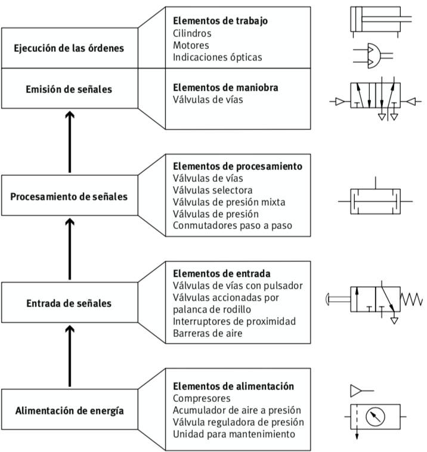
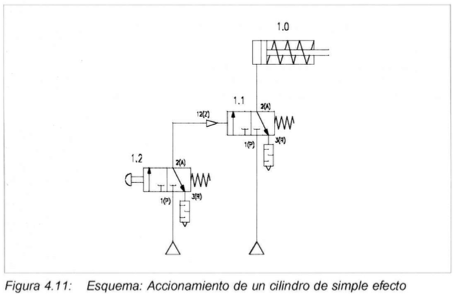
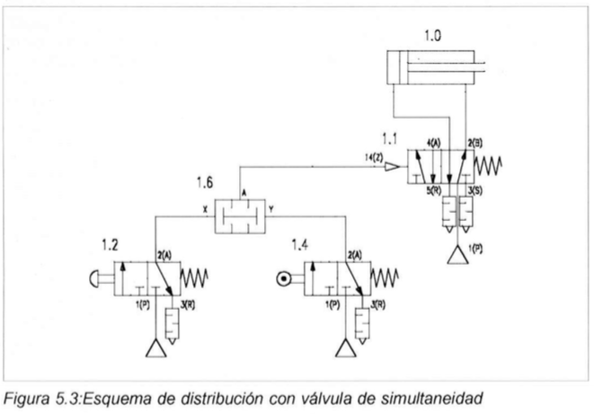

# Capítulo 4. Circuitos neumáticos

Para efectuar el montaje de los sistemas control, debe disponerse de un puesto de trabajo fijo. La alimentación de aire comprimido puede estar a cargo de un compresor móvil con silenciados (máximo 800kPa = 8 bar).

**La presión de funcionamiento deberá ser, como máximo, de $P = 600kPa = 6 bar$**

Para un funcionamiento óptimo, la presión de funcionamiento del sistema de control deberá ser máximo $P=500kPa = 5$ bar con aire sin lubricar.

## Estructura de un sistema neumático

### Esquema de conexiones del sistema

#### Código de señalización de los componentes

- Número del equipo empezando con 1; sólo se utiliza cuando el circuito de mando completo consta de más de un equipo.
- Número del circuito de mando comenzando con 1; todos los accesorios con 0.
- Señalización de los componentes por medio de letras
- Número de los componentes comenzando con 1

#### Esquema de conexiones

| Descripción               | Nomenclatura |
| ------------------------- | ------------ |
| De arriba hacia abajo     |              |
| Elemento de trabajo       | 1A           |
| Elemento de mando         | 1V2          |
| Elemento de procesamiento | 1V1          |
| Elemento de entrada       | 1S1,1S2,1S3  |
| Elemento de alimentación  | 0Z,0S        |

## Nomenclatura

En el siguiente documento se detalla las diferentes nomenclaturas para el nombramiento de los elementos en un circuito neumático.

<embed src="./identificaciones.pdf" width="100%" height="800px">

## Armando circuitos neumáticos

Armar los siguientes circuitos neumáticos para irse familiarizando con el software de simulación FluidSIM, conocer la ubicación de los elementos neumáticos y eléctricos. Configuración de válvulas y más elementos.

### Válvulas de control

### Válvulas combinacionales

---

- [Inicio](../index.md)
- [Capítulo 1](../capitulo1/index.md)
- [Capítulo 2](../capitulo2/index.md)
- [Capítulo 3](../capitulo3/index.md)
- [Capítulo 4](#capítulo-4-circuitos-neumáticos)
- [Bibliografía](../bibliografia.md)
