# Prácticas de clase - Circuitos Neumáticos

## Ejercicios Construyendo circuitos básicos

Construir el siguiente circuito neumático.

Accionar un cilindro de simple efecto con retorno de muelle, con una válvula 3/2 de accionamiento manual con retorno de muelle.

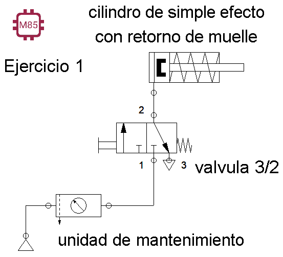

---

## Accionamiento directo vs indirecto

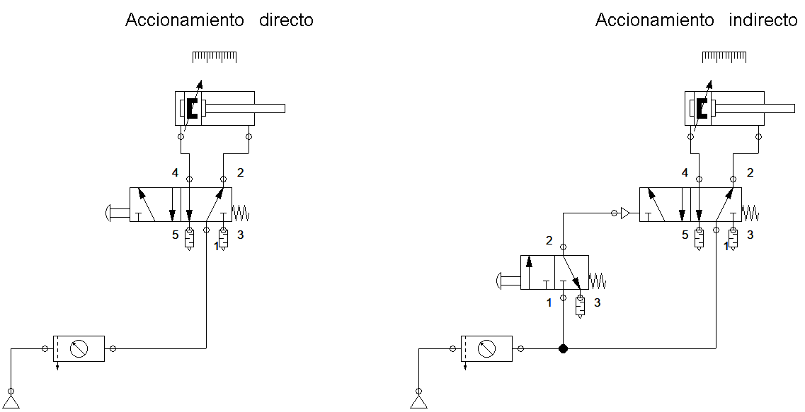

### Control indirecto

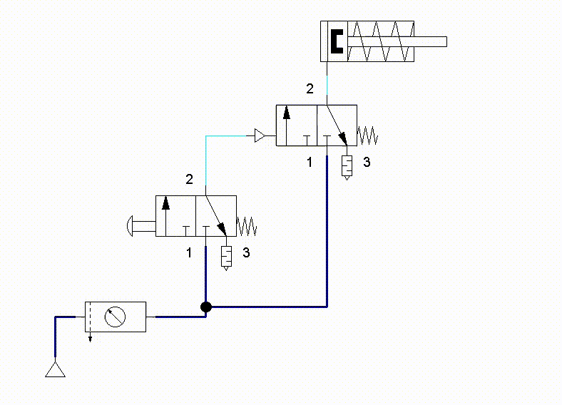

!!! note
    El accionamiento correcto es el control indirecto, dado que es el más seguro para el usuario ante cualquier falla o contingencia.

---

## Ejercicios

**1. Control de un cilindro de simple efecto con retorno de muelle, gobernado por una válvula de presión con retorno de muelle; las válvulas de control restantes son a elección propia del ingeniero (*Es con control indirecto*).**

**Solución:**

    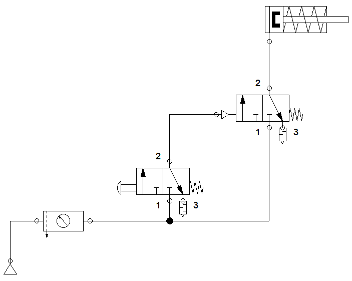

---

**2. Control de un cilindro de simple efecto con retorno de muelle, gobernado por una válvula de presión biestable, las válvulas de control restantes son a elección propia del ingeniero.**

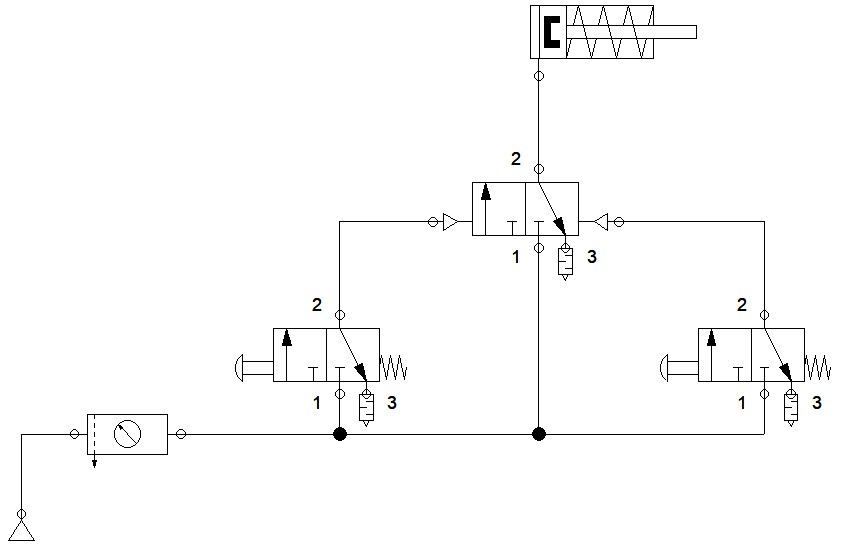

---

### Estructura

#### Estructura de circuitos neumáticos

<!-- TODO: Agregar la imagen -->

#### Nomenclatura de circuitos neumáticos

---

##### 3. Reproducir el siguiente diagrama y describir su funcionamiento

---

## Accionamiento por rodillo

Presentación y configuración del rodillo:

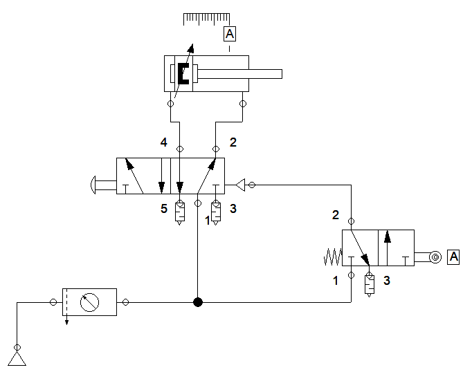

### Configuración de la válvula por rodillo y cilindro

Primero damos doble click sobre el rodillo o el cilindro

Si damos doble click sobre el rodillo, nos saldrá esta ventana donde colocamos la referencia que nos servirá para identificarlo. Por convención, se usa **A, B, C,...**

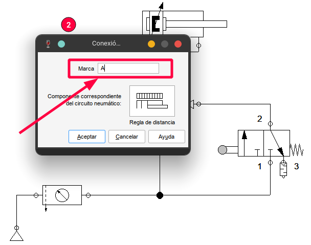

Damos Aceptar, y nos quedara la referencia del rodillo.

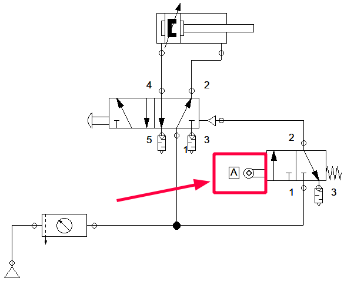

Ahora, si damos doble click sobre el cilindro, nos saldrá la siguiente ventana y  nos vamos a la pestaña "Etiquetas de accionamiento".

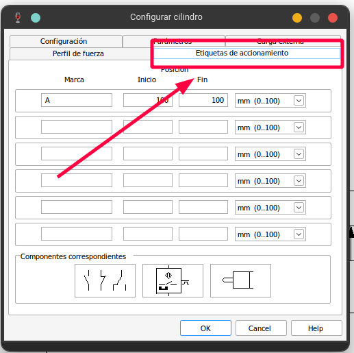

En esta sección debemos agregar la marca que se vinculara con el rodillo o sensor

Se coloca la marca **"A"** y en la posición que queremos que exista el sensor o que se accione, en este caso solo queremos que este unicamente al final del cilindro.

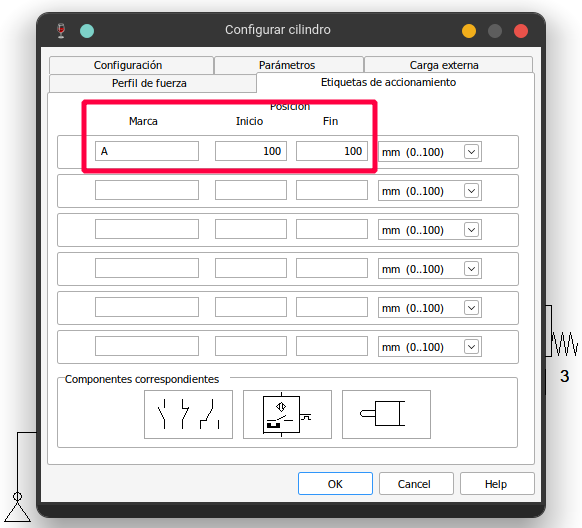

Aceptamos, y nos quedara la marca sobre el cilindro, dependiendo de donde lo hayamos configurado.

    

---

### Ejercicios

**1. Se debe controlar un cilindro de doble efecto, por medio de un botón, *Y* al mismo tiempo debe estar presionado una válvula por rodillo. Para que regrese el vástago del cilindro debe ser presionado otro botón**

Solución:

    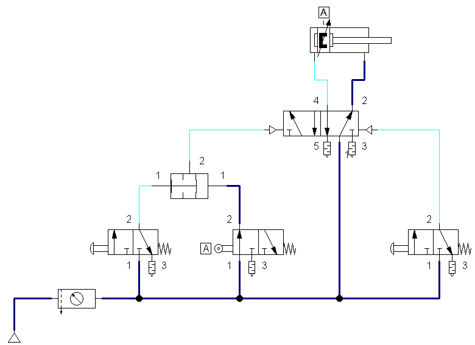
     
    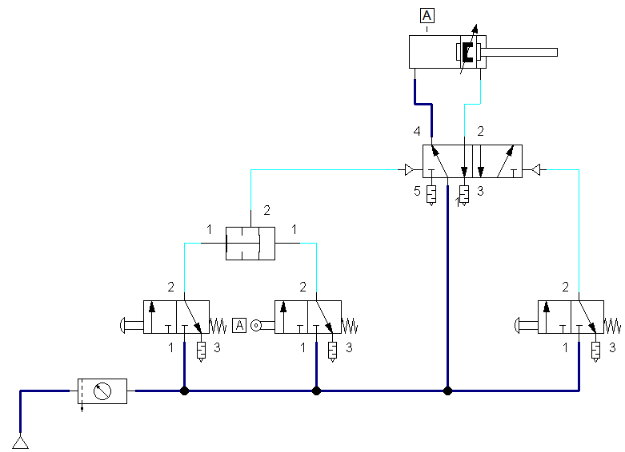
     
    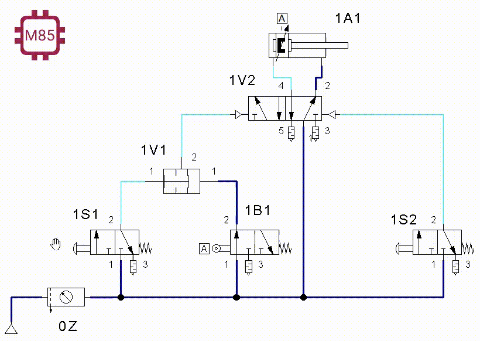

---

### Circuito A+ B+ A- B-

**2. Se debe accionar una válvula de manera manual para hacer salir el vástago del cilindro de doble efecto 1, cuando éste al 100% deber hacer salir el vástago del cilindro de doble efecto 2, cuando éste vástago este al 100% debe hacer regresar al vástago del cilindro de doble efecto 1 y el cilindro de doble efecto 2**

    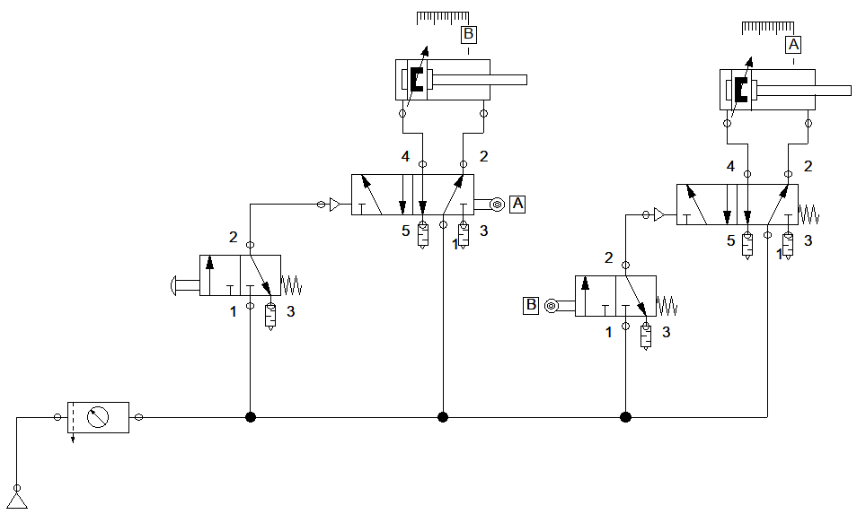
    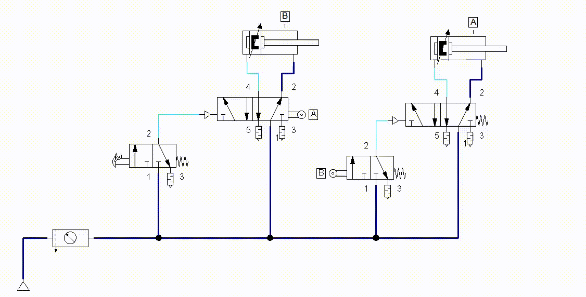

### Circuito A+ B+ B- A- (Descapotable)

Limites 95 y 5

    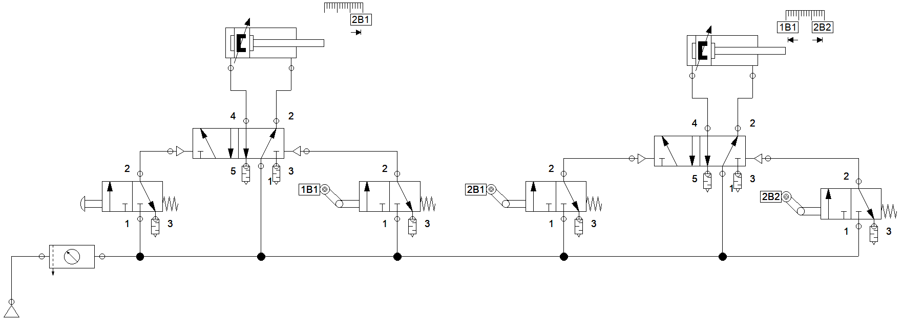

---

## Control de salida del vástago

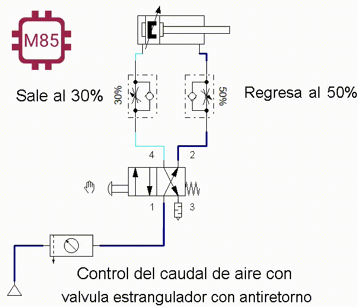

---

## Aplicaciones

### Control de puerta de un autobús

**El control de apertura y cierre de la puerta de un autobús es llevada a cabo por el chofer que acciona un botón para abrirla y otro botón para cerrarla. Pero para que este sistema funcione el autobus debe estar detenido, es decir, se debe estar presionando el freno (accionamiento por rodillo). Ademas, por fuera, debe existir un botón de enclavamiento (accionamiento por bloqueo con retorno de muelle), el cual debe abrir la puerta del autobus.
La entrada y salida del vástago es lenta, a un 50% en su cierre y a un 30% su apertura.**

### Elevador Simple

Tenemos un elevador, el cual se controla por medio de dos pulsadores, con uno podemos subir la plataforma (PS), y con el otro podemos bajar la plataforma (PB). Realiza un circuito neumático para el control, estos pulsadores esta en la parte inferior donde el operador realiza el control.

    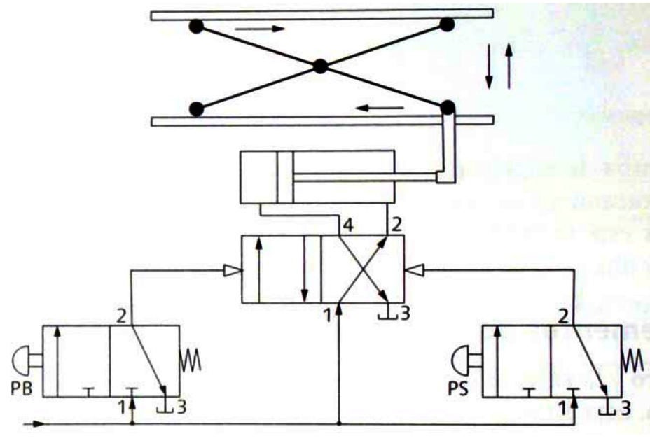

----

### Elevador (completo)

Ahora el elevador tiene doble control, es decir, cuenta con 4 botones para hacerlo funcionar. Tenemos 2 botones dentro del cajon que sube y en la parte inferior de la plataforma.
2 botones para subir, uno arriba y otro abajo, otros 2 para subir, arriba y abajo.

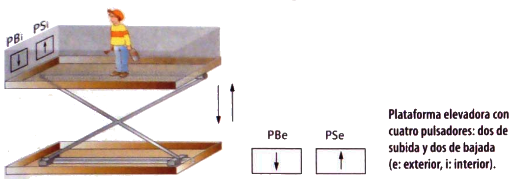

    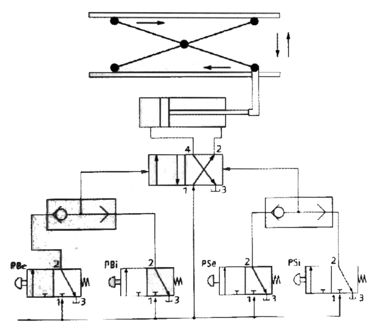
     
    
     
    

---

### Martillo neumático

---

### Papas a la francesa

**Se debe realizar un circuito neumático para el control del cortador de papas. Para que este funcione se deben cumplir 2 condiciones, con el pie el usuario lo debe activar, en la parte superior debe haber otra aplacan, cuando ambos estén accionados, la maquina comienza a operar automáticamente, es decir, saliendo y entrando el vástago del cilindro. Cuando se desactive por medio de la aplacan o el pedal, se debe detener.
De protección, se debe colocar una válvula principal para detener el flujo de aire del sistema.**

---

## Electroneumática

**Armar el siguiente circuito Electroneumático.**

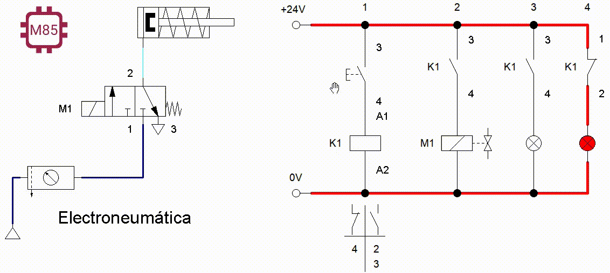

----

**Realizar un circuito electroneumático, el cual al presionar un botón salga el vástago, se suelta el botón y el vástago se mantiene, con otro botón se regresa el vástago, se debe usar una válvula biestable con solenoide.**

    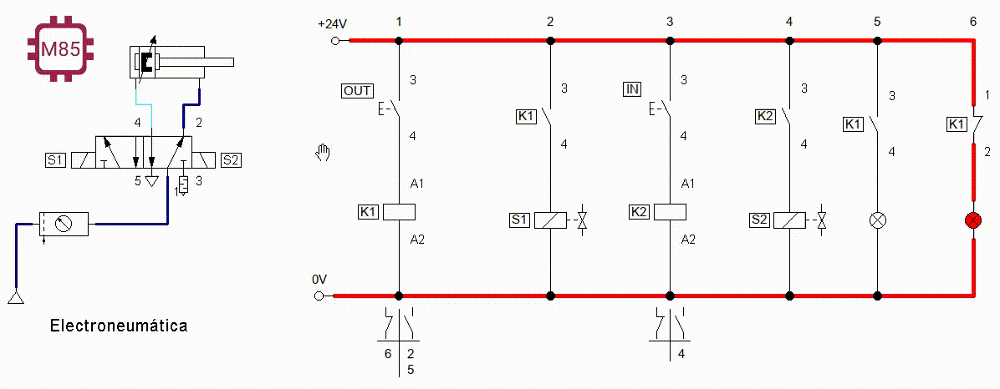
     

---

### Enclavamiento (Interlock)

Sistema de enclavamiento (interlock)

**Realizar el circuito de control eléctrico para cualquiera de estos dos circuitos. Al presionar un botón (S1) se debe salir el vástago, se suelta el botón (S1) y el vástago continua afuera, se presiona otro botón (S2) y el vástago regresa a su posición original.**

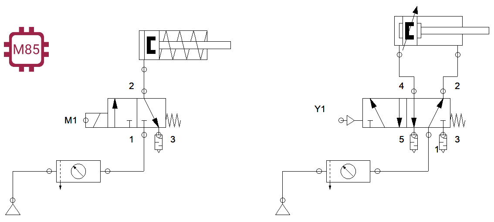

    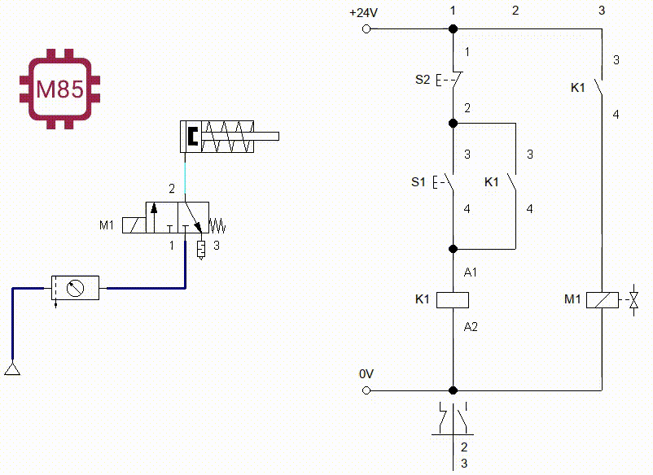
     
    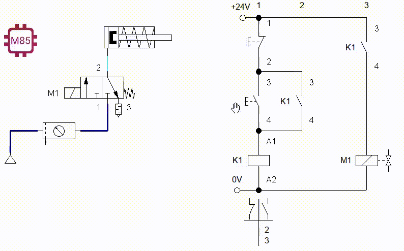
     
    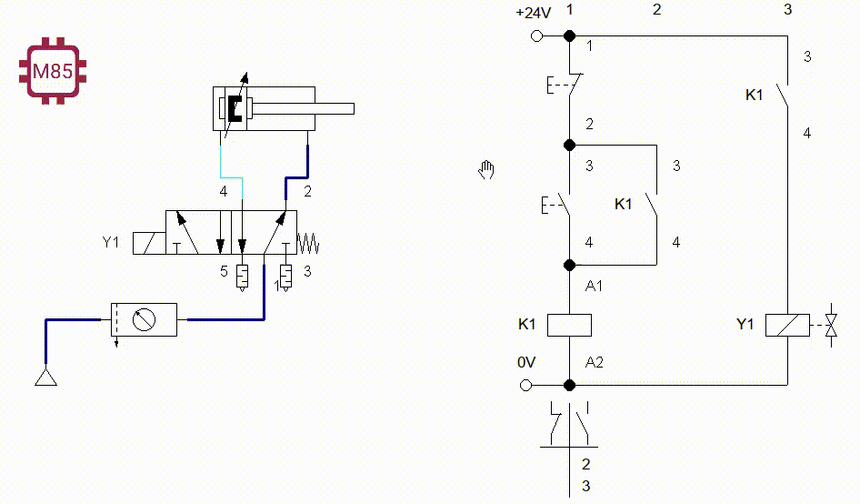

### Sensores

#### Sensor inductivo (Reed)

el sensor inductivo nos ayuda a conocer la posición del embolo, que esta dentro del cilindro. Este sensor seria lo equivalente a una `válvula de rodillo`.

La salida de la señal del sensor nos ayuda a alimentar la bobina del relay y realizar las acciones necesarias que necesitemos.

La forma de conexión es la siguiente:

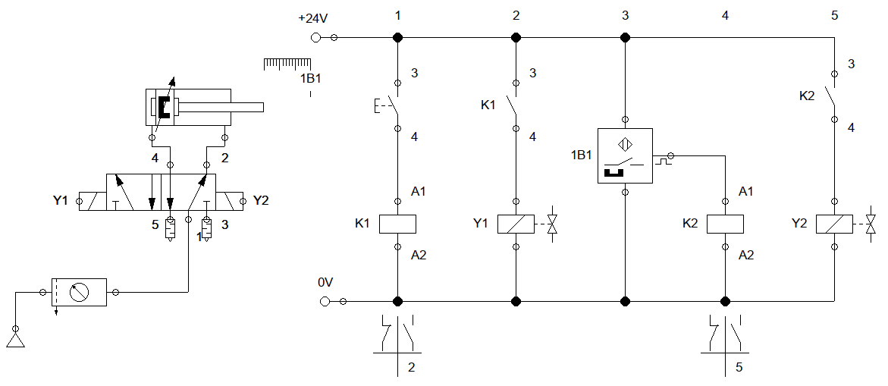

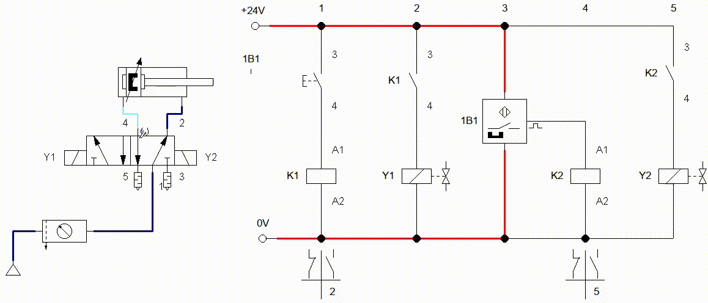

---

### Aplicaciones

### Prensa de placas

**En una estación se colocan a presión placas de características sobre cuerpos de válvulas.
En un primer lugar, se colocan las placas de características en los rebajes que poseen los cuerpos de las válvulas para tal fin.
Un cilindro aplica presión sobre ellas, para que queden embutidas. La operación de prensado del cuerpo de la válvula se activa mediante un pulsador.
Una vez sujeto el cuerpo de la válvula, se inicia la operación de prensado. Cuando el cilindro de prensado alcanza su posición delantera de final de carrera, ambos cilindros deben retroceder.**

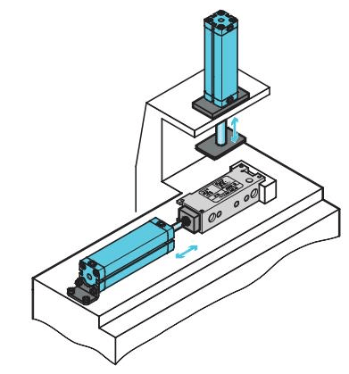

---

### Sistema transportador

**Los paquetes que llegan por transportador son elevados por un cilindro neumático A (1.0) y desplazados a otro transportador, mediante un segundo cilindro B (2.0), el regreso del actuador A será en el momento que el actuador B desplace la caja, *el actuador B regresará a su posición de inicio cuando A alcance su posición de reposo***.

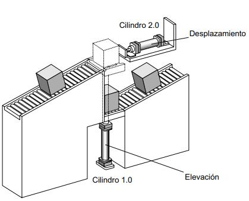

---

### Sistema de taladrado

**Unas piezas cúbicas de acero son alimentadas desde un almacén de carga por gravedad a una máquina de mecanizado, fijadas, mecanizadas y expulsadas. Un cilindro de doble efecto dispuesto horizontalmente, con el aire de escape estrangulado (1.0) empuja las piezas fuera del almacén bajo el husillo de la taladradora y las mantiene sujetas contra un tope fijo. El husillo de taladrado (2.0) avanza empujado por un cilindro, haciendo descender la broca. Una vez se ha alcanzado la profundidad deseada, fijada por una válvula de accionamiento por rodillo, empieza la carrera de retroceso sin restricción. Al finalizar la carrera de retroceso, la pieza es expulsada por un cilindro de simple efecto (3.0). Después de un período t = 0,6 segundos, empieza la carrera de retroceso rápida. Cuando el cilindro expulsor haya alcanzado la posición final retraída se acciona una cuarta válvula de rodillo, cuya señal puede utilizarse para permitir el inicio de un nuevo ciclo.**

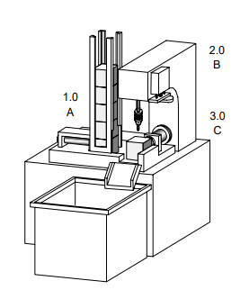

---

### Cargador para alimentación de ejes

**En numerosas máquinas de montaje o mecanizado es necesario alimentar ejes, tubos y similares. Esta operación suele ser automática. En la gráfica se aprecia un cargador de barras apiladas del que salen las piezas una a una. El tamaño del cargador puede adaptarse a la longitud de las piezas. En la salida del cargador hay una palanca basculante (vibratoria) para evitar atascos (ocasionados por la fricción y el peso de las piezas). Este sistema podría ser utilizado, por ejemplo, para alimentar piezas a una máquina lijadora. En el dibujo "b" se muestra una alternativa frente al cargador de piezas apiladas con salida mediante palanca basculante. En este caso se trata de un cargador con salida mediante un segmento que recoge las piezas una a una.**

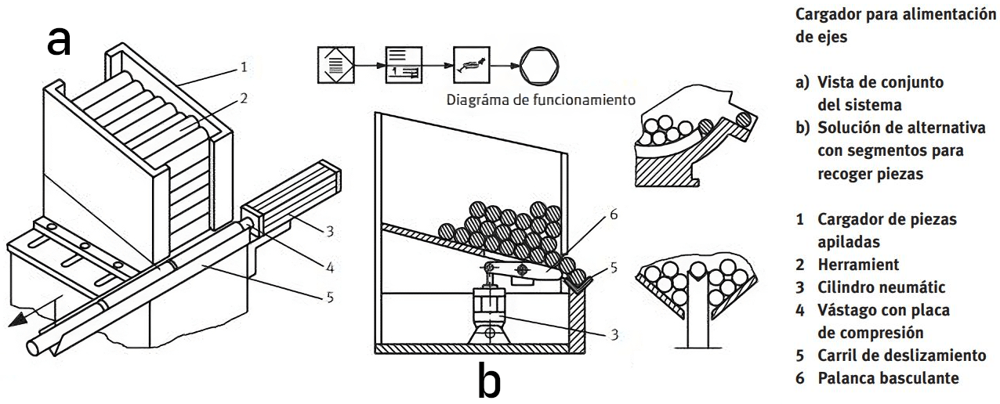

---

### Prensa Latas

**Diseñar el sistema de control electroneumático de una prensadora de latas, para esto deberá utilizar electroválvulas monoestables, la secuencia deberá ejecutarse de manera manual. Es decir, al presionar el pulsador que comience la secuencia, que realice todos los pasos y para volver a iniciar, se debe presionar de nuevo el botón**

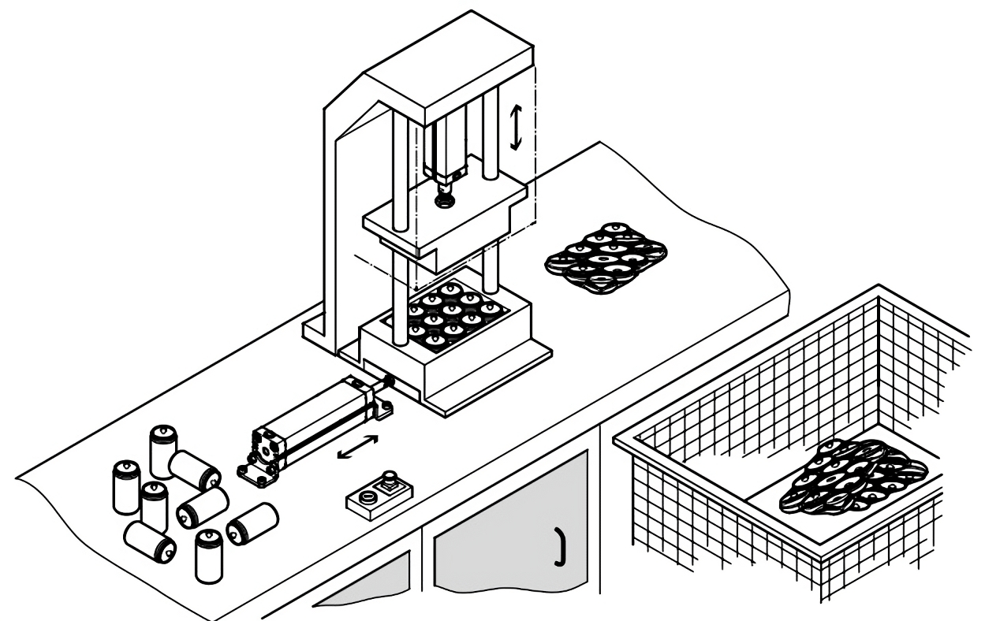

---

### Selector de cajas

Observar la siguiente animación, la cual consiste en controlar 2 cilindros, los cuales están montados sobre una banda transportadora.
El sistema debe detectar 3 tamaños de cajas, y con base a su altura se deben desplazar hacia otro sitio. Como se muestra en la animación.

---
