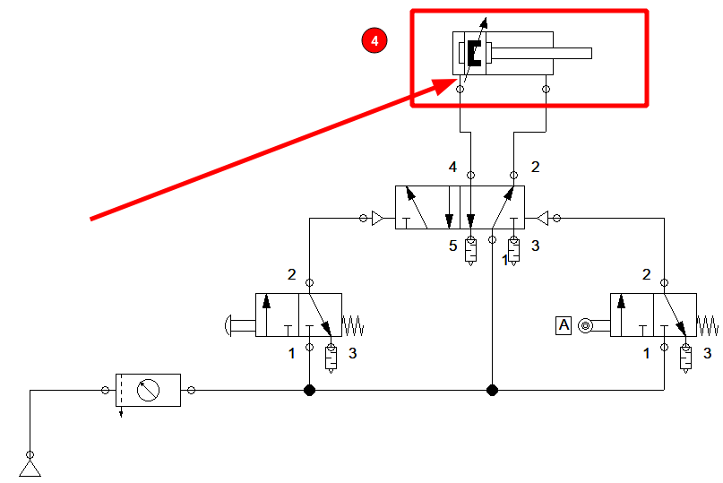
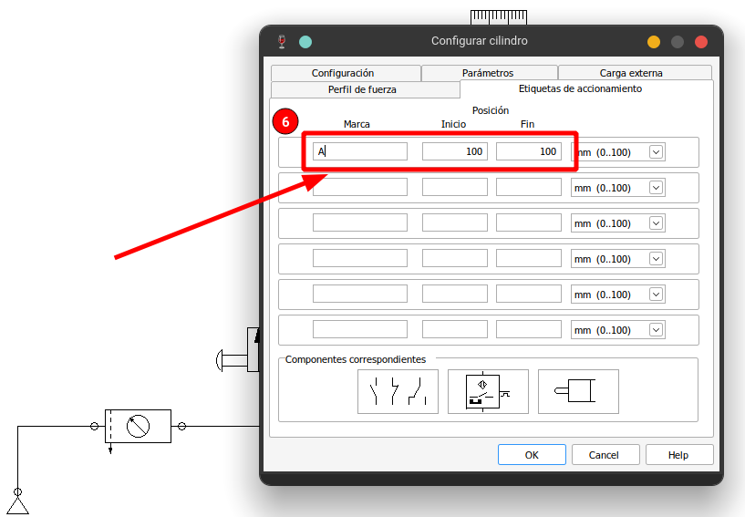

# Prácticas de clase - Circuitos Neumáticos

## Ejercicios Construyendo circuitos básicos

Construir el siguiente circuito neumático.

Accionar un cilindro de simple efecto con retorno de muelle, con una válvula 3/2 de accionamiento manual con retorno de muelle.

---

## Tipos de accionamientos

### Accionamiento directo

### Accionamiento indirecto

!!! note
    El accionamiento correcto es el control indirecto, dado que es el más seguro para el usuario ante cualquier falla o contingencia.

---

## Ejercicios

### Ejercicio 1

Control de un cilindro de simple efecto con retorno de muelle, gobernado por una válvula de presión con retorno de muelle; las válvulas de control restantes son a elección propia del ingeniero (*Es con control indirecto*).

Solución:

    

### Ejercicio 2

Control de un cilindro de simple efecto con retorno de muelle, gobernado por una válvula de presión biestable, las válvulas de control restantes son a elección propia del ingeniero.

Solución

### Nomenclatura de circuitos neumáticos

#### Ejercicio 3

Reproducir el siguiente diagrama y describir su funcionamiento

---

## Accionamiento por rodillo

Presentación y configuración por accionamiento de rodillo:

### Configuración de la válvula por rodillo y cilindro

Primero damos doble click sobre el rodillo o el cilindro

Si damos doble click sobre el rodillo, nos saldrá esta ventana donde colocamos la referencia que nos servirá para identificarlo. Por convención, se usa **A, B, C,...**

Damos **Aceptar**, y nos quedara la referencia del rodillo.

Ahora, si damos doble click sobre el cilindro, nos saldrá la siguiente ventana y  nos vamos a la pestaña "Etiquetas de accionamiento".

En esta sección debemos agregar la marca que se vinculara con el rodillo o sensor

Se coloca la marca **"A"** y en la posición que queremos que exista el sensor o que se accione, en este caso solo queremos que este unicamente al final del cilindro.

Aceptamos, y nos quedara la marca sobre el cilindro, dependiendo de donde lo hayamos configurado.

    

---

#### Ejercicio 4

**1. Se debe controlar un cilindro de doble efecto, por medio de un botón, *Y* al mismo tiempo debe estar presionado una válvula por rodillo. Para que regrese el vástago del cilindro debe ser presionado otro botón**

Solución:

    
     
    
     
    
     
    

---

### Circuito A+ B+ A- B-

Se debe accionar una válvula de manera manual para hacer salir el vástago del cilindro de doble efecto 1, cuando éste al 100% deber hacer salir el vástago del cilindro de doble efecto 2, cuando éste vástago este al 100% debe hacer regresar al vástago del cilindro de doble efecto 1 y el cilindro de doble efecto 2.

    
    
    

### Circuito A+ B+ B- A- (Descapotable)

Limites 95 y 5

    

---

## Control de salida del vástago

---

## Aplicaciones

### Control de puerta de un autobús

**El control de apertura y cierre de la puerta de un autobús es llevada a cabo por el chofer que acciona un botón para abrirla y otro botón para cerrarla. Pero para que este sistema funcione el autobus debe estar detenido, es decir, se debe estar presionando el freno (accionamiento por rodillo). Ademas, por fuera, debe existir un botón de enclavamiento (accionamiento por bloqueo con retorno de muelle), el cual debe abrir la puerta del autobus.
La entrada y salida del vástago es lenta, a un 50% en su cierre y a un 30% su apertura.**

### Elevador Simple

Tenemos un elevador, el cual se controla por medio de dos pulsadores, con uno podemos subir la plataforma (PS), y con el otro podemos bajar la plataforma (PB). Realiza un circuito neumático para el control, estos pulsadores esta en la parte inferior donde el operador realiza el control.

    

---

### Elevador (completo)

Ahora el elevador tiene doble control, es decir, cuenta con 4 botones para hacerlo funcionar. Tenemos 2 botones dentro del cajon que sube y en la parte inferior de la plataforma.
2 botones para subir, uno arriba y otro abajo, otros 2 para subir, arriba y abajo.

    
     
    
     
    `

---

### Martillo neumático

---

### Papas a la francesa

**Se debe realizar un circuito neumático para el control del cortador de papas. Para que este funcione se deben cumplir 2 condiciones, con el pie el usuario lo debe activar, en la parte superior debe haber otra aplacan, cuando ambos estén accionados, la maquina comienza a operar automáticamente, es decir, saliendo y entrando el vástago del cilindro. Cuando se desactive por medio de la aplacan o el pedal, se debe detener.
De protección, se debe colocar una válvula principal para detener el flujo de aire del sistema.**

