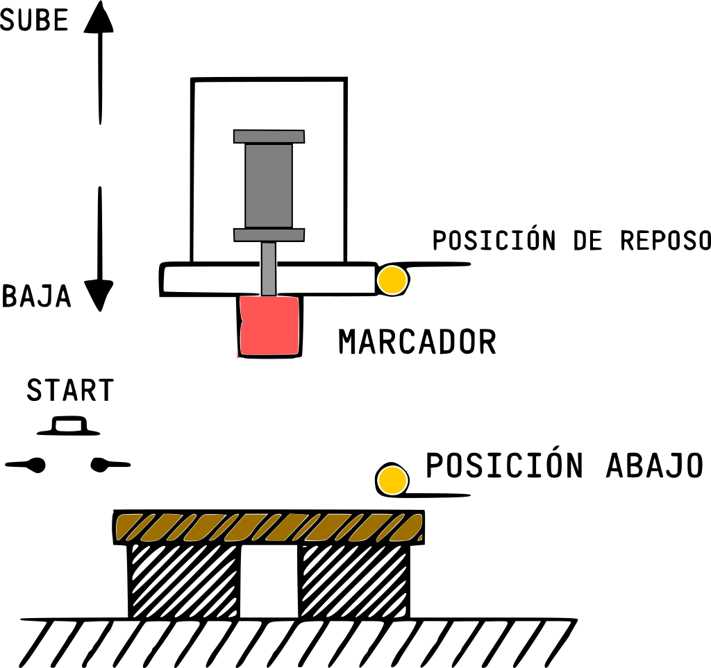

# Ejercicios

Realiza los **circuitos electroneumáticos** de los siguiente ejercicios:

1. Un proceso semiautomático consiste en efectuar marcas sobre bloques de madera. El diagrama que ilustra este proceso se muestra en la figura. Contiene: el marcador sube y baja a traves de un cilindro de doble efecto, dos sensores de posición: de posición de reposo y de posición abajo, cuando marca; con un pulsador arranca el marcado.
Cuando se presiona el pulsador, el marcador marca la madera y después de ello regresa a su posición origina, para que el vástago salga, primero debe estar en su posición de reposo.

    
    <!--  -->

2. **Selladora**: Tenemos una maquina que coloca un sello sobre una pieza, con un cilindro de vástago pasante (B), pero antes de que éste cilindro marque la caja, debe ser presionada o prensada la pieza, por otro cilindro (A) el cual ayuda a mantener la pieza en su lugar. Se tienen un sensor de rodillo para detectar la posición del cilindro A y otros dos rodillos para el cilindro B. Después, de que el cilindro B marque la pieza, ambos vástagos regresan a su posición original. Esto comienza a operar cuando el operario presione un botón. Ambos vástagos deben estar dentro para comenzar de nuevo a operar.

    

3. **Etiquetadora**: Tenemos una banda transportadora y 2 cilindros, cada cilindro tiene sus sensores de rodillo para conocer la posición del vástago. Esta maquina coloca etiquetas sobre cajas. El cilindro A saca su vástago cuando se detecta presencia de una caja enfrente, prensado la caja y deteniendo la banda transportadora, después baja el vástago del cilindro B, una vez coloca la etiqueta; es decir, llego al 100% el vástago y regresa, hará el que vástago del cilindro A se retraiga, una vez ambos vástagos están en su posición inicial, la banda transportadora vuelve arrancar, hasta que se vuelva a detectar otra caja y repitiendo el proceso anterior. Todo comienza a operar cuando presiona el botón de arranque (S1) y se tiene otro botón para detener todo el proceso (normalmente cerrado). Aunque el sensor detecte una caja enfrente, no debe accionar nada.

    

4. Sobre una banda transportadora (BT1) se colocan cajas; son cajas de dos tamaños diferentes. Cuando la caja se ubica frente a un cilindro 1, se ha seleccionado el tamaño de la caja y el cilindro arrastra la caja a una de dos posiciones: si la **caja es pequeña**, la ubica frente a **un cilindro 2** y si la **caja es grande** la ubica frente a un **cilindro 3**.  Una vez se ubica en la respectiva posición, de acuerdo a su tamaño, el cilindro correspondiente la arrastra hasta ubicarla sobre otra banda transportadora, asi, el cilindro 2 arrastra la caja pequeña hasta colocarla sobre la banda 2 y el cilindro 3 arrastra la caja grande y la ubica sobre la banda transportadora 3. Sensor 1 nos indica si la caja es pequeña y Sensor 2 nos manda la señal para cajas grandes.

    

5. Proceso del movimiento de cajas, viene la caja sobre una banda transportadora inferior, colocando la caja sobre la plataforma del cilindro A, en sensor A0 detecta la posición del vástago en su posición inicial, el sensor A1 cuando haya llegado al 100% la carrera del vástago. Cuando el vástago del cilindro A este al 100%, es decir, cuando este ahi la caja hasta arriba, el vástago del cilindro B saca su vástago, colocando la caja en la segunda banda transportadora, para detectar la posición del vástago del cilindro B, tenemos los sensores B0 y B1. Después, de que el cilindro B colocó la caja en la banda, deben regresar primero el vástago del cilindro B y por ultimo el vástago del cilindro A. La banda inferior se debe de detener si el cilindro A tiene el vástago fuera, hasta que este en su posición inicial, podrá funcionar la banda, para que coloque la caja en su plataforma. Para detectar donde esta la caja tenemos los sensores S0 y S1.

    
