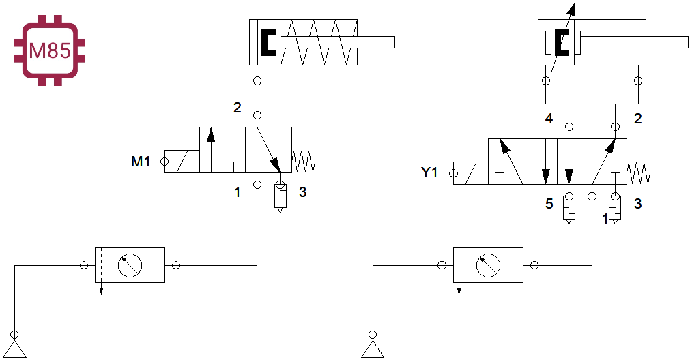
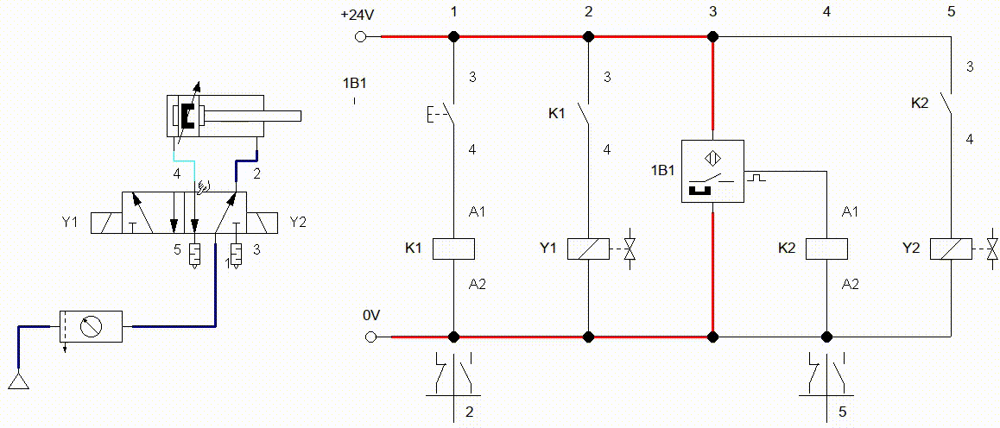

# Capítulo 6. Electroneumática

**Armar el siguiente circuito Electroneumático.**

Realizar un circuito electroneumático, el cual al presionar un botón salga el vástago, se suelta el botón; el vástago se mantiene fuera, con otro botón se regresa el vástago, se debe usar una válvula biestable con solenoide.

    
     

## Sistema de enclavamiento (interlock)

Realizar el circuito de control eléctrico para cualquiera de estos dos circuitos. Al presionar un botón (S1) se debe salir el vástago, se suelta el botón (S1) y el vástago continua afuera, se presiona otro botón (S2) y el vástago regresa a su posición original.

    
     
    
     
    

### Ejercicios

1. Control de cilindro de simple efecto con válvula de 3/2 monoestable accionada por ==solenoide== con retorno de muelle, el vástago debe salir de forma suave. Controlada por botón.
2. Control de cilindro de simple efecto con válvula de 3/2 monoestable accionada por ==solenoide== con retorno de muelle, el vástago debe salir de forma suave. Controlada por interruptor.
3. Control de cilindro de simple efecto con válvula de 3/2 monoestable accionada por ==solenoide== con retorno de muelle, el vástago debe salir de forma suave. Controlada por botón de enclavamiento con luces indicativas.
4. Control de un cilindro de doble efecto por medio de una válvula 5/2 biestable accionada por ==solenoide==, con botoneras, cuando se active el botón 1 el cilindro expulsará el vástago, cuando sea presionado el botón 2 el vástago entrará. Cuando sea presionado cada botón se debe encender una luz indicativa.
5. Control de un cilindro de doble efecto por medio de una válvula 5/2 monoestable accionada por ==solenoide== con retorno de muelle, cuando el botón (NA) de arranque se presione se activará la ==solenoide== y expulsará el vastago, el botón se debe enclavar; cuando sea presionado el segundo botón (NC), desenergizará la ==solenoide== y el vástago regresará. Debe contar con sus luces indicativas

### Sensores

#### Sensor inductivo (Reed)

el sensor inductivo nos ayuda a conocer la posición del embolo, que esta dentro del cilindro. Este sensor seria lo equivalente a una `válvula de rodillo`.

La salida de la señal del sensor nos ayuda a alimentar la bobina del relay y realizar las acciones necesarias que necesitemos.

La forma de conexión es la siguiente:

## Aplicaciones

## Prensa de placas

**En una estación se colocan a presión placas de características sobre cuerpos de válvulas.
En un primer lugar, se colocan las placas de características en los rebajes que poseen los cuerpos de las válvulas para tal fin.
Un cilindro aplica presión sobre ellas, para que queden embutidas. La operación de prensado del cuerpo de la válvula se activa mediante un pulsador.
Una vez sujeto el cuerpo de la válvula, se inicia la operación de prensado. Cuando el cilindro de prensado alcanza su posición delantera de final de carrera, ambos cilindros deben retroceder.**

## Sistema transportador

Los paquetes que llegan por transportador son elevados por un cilindro neumático A (1.0) y desplazados a otro transportador, mediante un segundo cilindro B (2.0), el regreso del actuador A será en el momento que el actuador B desplace la caja, *el actuador B regresará a su posición de inicio cuando A alcance su posición de reposo*.

## Sistema de taladrado

Unas piezas cúbicas de acero son alimentadas desde un almacén de carga por gravedad a una máquina de mecanizado, fijadas, mecanizadas y expulsadas. Un cilindro de doble efecto dispuesto horizontalmente, con el aire de escape estrangulado (1.0) empuja las piezas fuera del almacén bajo el husillo de la taladradora y las mantiene sujetas contra un tope fijo. El husillo de taladrado (2.0) avanza empujado por un cilindro, haciendo descender la broca. Una vez se ha alcanzado la profundidad deseada, fijada por una válvula de accionamiento por rodillo, empieza la carrera de retroceso sin restricción. Al finalizar la carrera de retroceso, la pieza es expulsada por un cilindro de simple efecto (3.0). Después de un período t = 0,6 segundos, empieza la carrera de retroceso rápida. Cuando el cilindro expulsor haya alcanzado la posición final retraída se acciona una cuarta válvula de rodillo, cuya señal puede utilizarse para permitir el inicio de un nuevo ciclo.

## Cargador para alimentación de ejes

En numerosas máquinas de montaje o mecanizado es necesario alimentar ejes, tubos y similares. Esta operación suele ser automática. En la gráfica se aprecia un cargador de barras apiladas del que salen las piezas una a una. El tamaño del cargador puede adaptarse a la longitud de las piezas. En la salida del cargador hay una palanca basculante (vibratoria) para evitar atascos (ocasionados por la fricción y el peso de las piezas). Este sistema podría ser utilizado, por ejemplo, para alimentar piezas a una máquina lijadora. En el dibujo "b" se muestra una alternativa frente al cargador de piezas apiladas con salida mediante palanca basculante. En este caso se trata de un cargador con salida mediante un segmento que recoge las piezas una a una.

## Prensa Latas

Diseñar el sistema de control electroneumático de una prensadora de latas, para esto deberá utilizar electroválvulas monoestables, la secuencia deberá ejecutarse de manera manual. Es decir, al presionar el pulsador que comience la secuencia, que realice todos los pasos y para volver a iniciar, se debe presionar de nuevo el botón

## Selector de cajas

Observar la siguiente animación, la cual consiste en controlar 2 cilindros, los cuales están montados sobre una banda transportadora.
El sistema debe detectar 3 tamaños de cajas, y con base a su altura se deben desplazar hacia otro sitio. Como se muestra en la animación.

