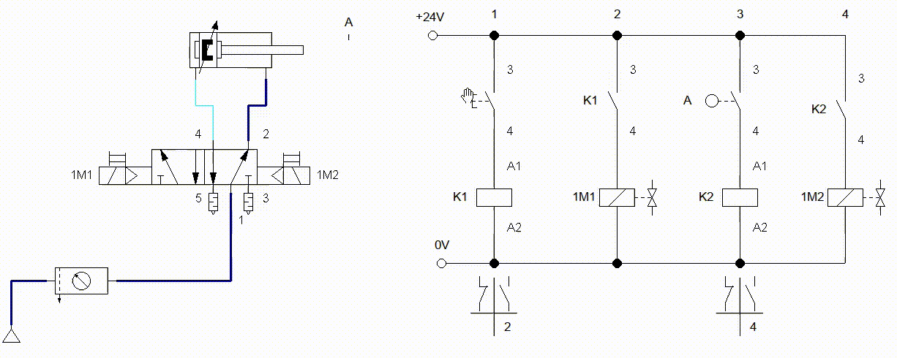
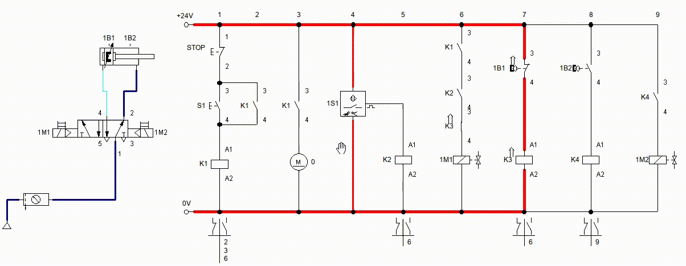
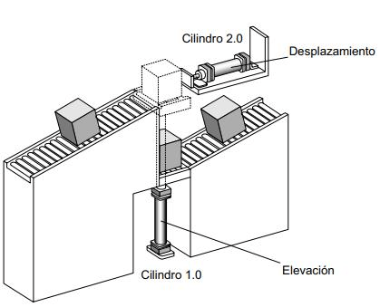

# Capítulo 6. Electroneumática

**Armar el siguiente circuito Electroneumático.**

## Ejercicio 1

Realizar un circuito electroneumático, el cual al presionar un botón salga el vástago, se suelta el botón; el vástago se mantiene fuera, con otro botón se regresa el vástago, se debe usar una válvula biestable con solenoide.

    
     

## Sistema de enclavamiento (interlock)

Realizar el circuito de control eléctrico para cualquiera de estos dos circuitos. Al presionar un botón (S1) se debe salir el vástago, se suelta el botón (S1) y el vástago continua afuera, se presiona otro botón (S2) y el vástago regresa a su posición original. S1 es un botón normalmente abierto, S2 es un botón normalmente cerrado.

    
     
    
     
    

### Ejercicio 2

Control de cilindro de simple efecto con válvula monoestable accionada por solenoide con retorno de muelle, el vástago debe salir de forma suave. Controlada por botón.

    
     
    
     
    
     

### Ejercicio 3

Control de cilindro de simple efecto con válvula de 3/2 monoestable accionada por solenoide con retorno de muelle, el vástago debe salir de forma suave. **Controlada por botón de enclavamiento**, con luz indicativa que el vástago esta fuera (color rojo) y si esta dentro el vástago con luz verde.

    
     
    
     
    
     

### Sensores

#### Final de carrera (Limit switch)

Este sensor seria lo equivalente a una `válvula accionada por rodillo`. Este tipo de sensor nos ayuda a saber la posición del algún elemento, como podría ser el vástago, o cualquier otro elemento mecánico que lo toque o lo presione.
Nos puede ayudar a contar algún objeto, las veces que lo toca o empuja.

<figure markdown="1">
    
<figcaption>Limit Switch Símbolo NA (Normalmente abierto), NA (Normalmente cerrado)</figcaption>
</figure>

<figure markdown="1">
    
<figcaption>Limit Switch Físico</figcaption>
</figure>

##### Circuito

Se muestra como se utiliza en el siguiente circuitos electroneumático

##### Ejercicio 4 (1A+ 2A+  1A-2A-)

Realizar el circuito electroneumático para el diagrama de movimientos indicado con **electroválvulas biestables** por solenoide y cilindros de doble efecto. Pulsadores de un ciclo, paro y repetición de ciclos por impulso momentáneo.
Al pulsar S1 y estar los dos vástagos dentro, debe salir el vástago de 1A. El vástago de 1A acciona 1B2, que hace salir al vástago de 2A. El vástago de 2A acciona 2B2, que hacen entrar a ambos vástagos a la vez.

    
     
    
     
    
     
    

#### Sensor magnético (Reed) y Switch Reed

> El sensor magnético nos ayuda a **conocer la posición del émbolo**, que esta dentro del cilindro. Estos están colocados sobre el cuerpo del cilindro.

La salida de la señal del sensor nos ayuda a alimentar la bobina del relay y realizar las acciones necesarias que necesitemos.

La forma de conexión del **sensor reed** es la siguiente:

## Compuertas lógicas con contactos

### Ejercicio

Replicar las compuertas lógicas con botones, encendiendo una lampara.

## Banda transportadora

Vamos a realizar un para arranque de una banda transportadora con motor eléctrico.

## Inversion de giro de motor

Realizar un circuito para inversion de giro de motor,
con un boton se activa giro a la derecha y con otro boton gira a la izquierda, una mas para que detenerlo. Puede ser con boton o sistema de enclavamiento. Si esta girando para un lado, no se debe poder activar la inversion de giro, primero se debe detener para que elija el sentido.

    

### Banda transportadora básica

Vamos a realizar control de una banda transportadora y el expulsado de piezas hacia la banda.

Cuando se presione el botón S1 debe arrancar la banda transportadora, en ese momento si el sensor óptico 1S1 detecta si hay alguna pieza enfrente, manda la señal para que el cilindro 1A, sacando su vástago expulsado la pieza del contenedor y mandándolo a la banda.
Para que salga el vástago, primero se debió arrancar el sistema, de lo contrario aunque exista pieza y sea detectada, no deberá accionar el cilindro.
Utilizar un switch reed 1B2 para detectar cuando el vástago llego al 100% mande la indicación a la solenoide y regrese el vástago.
Para que el vástago vuelva a salir, debe regresar a su posición inicial.
El control del sistema se utiliza el sistema de enclavamiento. Para que todo se detenga se presiona el botón de STOP.

    
     
    
     
    

### Banda transportadora con 2 cilindros

Vamos a realizar control de una banda transportadora y el expulsado de piezas hacia la banda y desviarla a otra sección.

Para que el sistema comience a operar, se debe presionar el botón **S1**, y para detener todo el proceso se presiona **S2** (STOP). Se aplica el sistema de enclavamiento (interlock).
Cuando el sistema arranca, comienza a operar la banda transportadora.
Cuando el **sensor óptico 1S1** detecta objeto enfrente, manda a accionar el **cilindro 1A**, sacando su vástago al 100% y a su ves saca la pieza hacia otra sección. Para que vuelva a salir, el vástago debe estar en su posición inicial.
Cuando el **sensor óptico 2S1** detecta objeto enfrente, manda a accionar el **cilindro 2A**, sacando su vástago al 100% y a su ves saca la pieza hacia la banda transportadora. Para que vuelva a salir, el vástago debe estar en su posición inicial.
Si el sistema no esta operando, aunque los sensores 1S1 y 2S1, no deben accionar a los cilindros.

    
     
    
     
    

### Banda transportadora con paro automático

Vamos a realizar control de una banda transportadora y el expulsado de piezas hacia la banda y desviarla a otra sección.

Para que el sistema comience a operar, se debe presionar el botón **S1**, y para detener todo el proceso se presiona **S2** (STOP). Se aplica el sistema de enclavamiento (interlock).
Cuando el sistema arranca, comienza a operar la banda transportadora.
Cuando el **sensor óptico 1S1** detecta objeto enfrente, manda a accionar el **cilindro 1A**, sacando su vástago al 100% y a su ves saca la pieza hacia la banda transportadora. Para que vuelva a salir, el vástago debe estar en su posición inicial.
Cuando el **sensor óptico 2S1** detecta objeto enfrente, manda a accionar el **cilindro 2A**, sacando su vástago al 100% y a su ves saca la pieza hacia otra sección. Para que vuelva a salir, el vástago debe estar en su posición inicial.
Si el sistema no esta operando, aunque los sensores 1S1 y 2S1, no deben accionar a los cilindros.
**Todo el procesos se debe detener en automático cuando el cilindro 2A saque la ultima pieza.**
**Para que comience a operar el sistema, primero debe existir una pieza enfrente del sensor.**

    
     
    
     
    

## Prensa de placas

En una estación se colocan a presión placas de características sobre cuerpos de válvulas.
En un primer lugar, se colocan las placas de características en los rebajes que poseen los cuerpos de las válvulas para tal fin.
Un cilindro aplica presión sobre ellas, para que queden embutidas. La operación de prensado del cuerpo de la válvula se activa mediante un pulsador.
Una vez sujeto el cuerpo de la válvula, se inicia la operación de prensado. Cuando el cilindro de prensado alcanza su posición delantera de final de carrera, ambos cilindros deben retroceder.

## Sistema transportador

Los paquetes que llegan por transportador son elevados por un cilindro neumático A (1.0) y desplazados a otro transportador, mediante un segundo cilindro B (2.0), el regreso del actuador A será en el momento que el actuador B desplace la caja, *el actuador B regresará a su posición de inicio cuando A alcance su posición de reposo*.

## Sistema de taladrado

Unas piezas cúbicas de acero son alimentadas desde un almacén de carga por gravedad a una máquina de mecanizado, fijadas, mecanizadas y expulsadas. Un cilindro de doble efecto dispuesto horizontalmente, con el aire de escape estrangulado (1.0) empuja las piezas fuera del almacén bajo el husillo de la taladradora y las mantiene sujetas contra un tope fijo. El husillo de taladrado (2.0) avanza empujado por un cilindro, haciendo descender la broca. Una vez se ha alcanzado la profundidad deseada, fijada por una válvula de accionamiento por rodillo, empieza la carrera de retroceso sin restricción. Al finalizar la carrera de retroceso, la pieza es expulsada por un cilindro de simple efecto (3.0). Después de un período t = 0,6 segundos, empieza la carrera de retroceso rápida. Cuando el cilindro expulsor haya alcanzado la posición final retraída se acciona una cuarta válvula de rodillo, cuya señal puede utilizarse para permitir el inicio de un nuevo ciclo.

## Cargador para alimentación de ejes

En numerosas máquinas de montaje o mecanizado es necesario alimentar ejes, tubos y similares. Esta operación suele ser automática. En la gráfica se aprecia un cargador de barras apiladas del que salen las piezas una a una. El tamaño del cargador puede adaptarse a la longitud de las piezas. En la salida del cargador hay una palanca basculante (vibratoria) para evitar atascos (ocasionados por la fricción y el peso de las piezas). Este sistema podría ser utilizado, por ejemplo, para alimentar piezas a una máquina lijadora. En el dibujo "b" se muestra una alternativa frente al cargador de piezas apiladas con salida mediante palanca basculante. En este caso se trata de un cargador con salida mediante un segmento que recoge las piezas una a una.

## Prensa Latas

Diseñar el sistema de control electroneumático de una prensadora de latas, para esto deberá utilizar electroválvulas monoestables, la secuencia deberá ejecutarse de manera manual. Es decir, al presionar el pulsador que comience la secuencia, que realice todos los pasos y para volver a iniciar, se debe presionar de nuevo el botón

## Selector de cajas

Observar la siguiente animación, la cual consiste en controlar 2 cilindros, los cuales están montados sobre una banda transportadora.
El sistema debe detectar 3 tamaños de cajas, y con base a su altura se deben desplazar hacia otro sitio. Como se muestra en la animación.

<!-- TODO: agregar ejercicios con relay on y off delay -->
