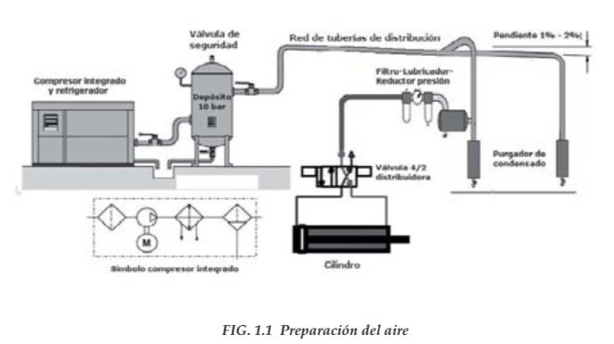

<!-- ---
title: "Neumática e Hidráulica"
author: "Alejandro Leyva"
date: "26/08/2019"
output: html_document
bibliography: bibliografia.md
references:
- id: jalmx89
  title: Neumática e Hidráulica
  author:
  - family: Fenner
    given: Martin
  container-title: Nature Materials
  volume: 1
  URL: 'https://www.alejandro-leyva.com/'
  DOI: 10.1038/nmat3283
  issue: 4
  publisher: Xizuth
  page: 1-n
  type: book
  issued:
    year: 2019
    month: 3 -->
<!-- --- -->

# Neumática e Hidráulica

## Capítulo 1. Conceptos básicos

### Neumática

> La palabra neumática se refiere al estudio del movimiento del aire.

Los sistemas de aire comprimido proporcionan un movimiento controlado con el empleo de cilindros y motores neumáticos y se aplican en herramientas, válvulas de control y posicionadotes, martillos neumáticos, pistolas para pintar, motores neumáticos, sistemas de empaquetado, elevadores, herramientas de impacto, prensas neumáticas, robots industriales, vibradores, frenos neumáticos, etc.

Las ventajas que presenta el uso de la neumática son el bajo coste de sus componentes, su facilidad de diseño e implementación y el bajo par o la fuerza escasa que puede desarrollar a las bajas presiones con que trabaja (típico 6 bar) lo que constituye un factor de seguridad. Otras características favorables son el riesgo nulo de explosión, su conversión fácil al movimiento giratorio así como al lineal, la posibilidad de transmitir energía a grandes distancias, una construcción y mantenimiento fáciles y la economía en las aplicaciones.

Entre las desventajas figura la imposibilidad de obtener velocidades estables debido a la compresibilidad del aire, los altos costes de la energía neumática y las posibles fugas que reducen el rendimiento.

La neumática precisa de una estación de generación y preparación del aire comprimido formada por un compresor de aire, un depósito, un sistema de preparación del aire (filtro, lubricador y regulador de presión), una red de tuberías para llegar al utilizador y un conjunto de preparación del aire para cada dispositivo neumático individual (figura 1.1).

Los sistemas neumáticos se complementan con los eléctricos y electrónicos lo que les permite obtener un alto grado de sofisticación y flexibilidad. Utilizan válvulas solenoide, señales de realimentación de interruptores magnéticos, sensores e interruptores eléctricos de final de carrera. El PLC (programmable logic controller) les permite programar la lógica de funcionamiento de un cilindro o de un conjunto de cilindros realizando una tarea específica.

En determinadas aplicaciones, tales como en movimientos de aproximación rápido y avance lento, típicos de las fresadoras y rectificadoras, en la sujeción de piezas utilizada en los cortes a alta velocidad sobre materiales duros y en la automatización de procesos de producción, se combinan la neumática y la hidráulica en un _circuito oleoneumático_, utilizando la parte neumática para el accionamiento y control y la parte hidráulica para el actuador.

### Hidráulica

La hidráulica utiliza básicamente los fluidos hidráulicos como medios de presión para mover los pistones de los cilindros. En la figura 1.2 se representa el movimiento típico de un pistón dentro del cilindro gracias a la energía proporcionada por un sistema hidráulico formado por una bomba, un depósito y un conjunto de tuberías que llevan el fluido a presión hasta los puntos de utilización.

Dentro de estos sistemas se encuentran los motores hidráulicos con velocidades que abarcan desde 0,5 rpm hasta 10.000 rpm y el par que proporcionan va desde 1 N/m (baja velocidad) hasta 20.000 N/m (alta velocidad).

Los sistemas hidráulicos se aplican típicamente en dispositivos móviles tales como maquinaria de construcción, excavadoras, plataformas elevadoras, aparatos de elevación y transporte, maquinaria para agricultura y simuladores de vuelo.

Sus aplicaciones en dispositivos fijos abarcan la fabricación y montaje de máquinas de todo tipo, líneas transfer, aparatos de elevación y transporte, prensas, máquinas de inyección y moldeo, máquinas de laminación, ascensores y montacargas.

Tienen las siguientes **ventajas**:

Gran potencia transmitida con pequeños componentes, posicionamiento preciso, arranque con cargas pesadas, movimientos lineales independientes de la carga ya que los líquidos son casi incompresibles y pueden emplearse válvulas de control, operación suave e inversa, buen control y regulación y disipación favorable de calor.

Y entre sus **desventajas** figuran:

Polución del ambiente con riesgo de incendio y accidentes en el caso de fuga de aceite, sensibilidad a la suciedad, peligro presente debido a las excesivas presiones, dependencia de la temperatura por cambios en la viscosidad.

Análogamente a los sistemas neumáticos, los sistemas hidráulicos se complementan con los eléctricos y electrónicos mediante dispositivos tales como válvulas solenoide, señales de realimentación de interruptores magnéticos, sensores e interruptores eléctricos de final de carrera. Es fácil, en particular en sistemas complejos, acoplarles un PLC (programmable logic controller) que les permite programar la lógica de funcionamiento de varios cilindros.

En determinadas aplicaciones, tales como en movimientos de aproximación rápido y avance lento, típicos de las fresadoras y rectificadoras, en la sujeción de piezas utilizada en los cortes a alta velocidad sobre materiales duros y en la automatización de procesos de producción, se combinan los sistemas neumático, hidráulico y eléctrico en la forma siguiente:

- _Circuito electroneumático_ – Accionamiento eléctrico - Actuador neumático.
- _Circuito oleoneumático_ – Accionamiento neumático – Actuador hidráulico.
- _Circuito electrohidráulico_ – Accionamiento eléctrico – Actuador hidráulico.

### Presión

> La fuerza normal aplicada por unidad de área.

> La presión ejercida de un fluido sobre una superficie - y viserversa - el cociente entre la fuerza y la superficie que recibe su acción. Es decir,

$$
$$

**En donde:**

$P = Presión \text{ } (N/m^2)$
$F = Fuerza \text{ } (N)$
$A = Área \text{ } (m^2)$

Visto la definición deducimos que para aumentar la fuerza que ejerce un fluido tenemos dos opciones.

- Aumentar la presión del fluido.
- Aumentar la superficie sobre la que actúa el fluido.

#### Equivalencias

##### Fuerza

$$1\text{ }N = 1 \text{ }kgm/s^2$$

$$1\text{ }kgf = 1 \text{ }kp = 9.81N$$

$kgf = \text{kilogramo-fuerza}$
$kp = \text{kilopondio}$

##### Presión

$$1 \text{ pascal (Pa)} = 1 \text{ Newton por metro cuadrado} (N/m^2)$$

$$1kPa = 1,000 N/m^2$$

$$\color{red}{\text{revisar->>} 1bar = 1MPa=0,9869 atm=1,01972 kgf/cm^2} $$

#### Tipos de presión

##### Presión atmosférica

- Peso de la atmósfera sobre la superficie de la tierra.
- Se originia debido al peso del aire que actúa sobre todo cuerpo ubicado en la superficie terrestre.
- Se manifiesta con la misma intensidad en todas las direcciones.
- El instrumento que mide la presión atmosférica se llama barómetro debido a lo cual se le denomina **_presión barométrica_**.

$$\text{Presión atmosférica} = \text{presión barométrica}$$

La presión atmosférica al nivel del mar es $101.325 kPa$, o $14.7 lb/in^2$. Debido a que la presión atmosférica participa en gran número de cálculos, con frecuencia se usa una unidad de pre­sión de 1 **_atmósfera_** (atm), definida como la presión media que la atmósfera ejerce al nivel del mar, es decir, $101.3 kPa$.

###### **Equivalencias**

$$1 atm = 14.7 psi =1,013 bar = 101.325kPa$$

$$ 1N/m^2 = 9.869 \times 10^{-6} atm = 10^{-5} bar$$

##### Presión manométrica o Presión relativa

Medida de presión por encima de la presión atmosférica.

###### **Manométro**

Es un instrumento de medición para la presión de fluidos contenidos en recipientes cerrados. Se distinguen dos tipos de manómetros, según se empleen para medir la presión de líquidos o de gases.

En la siguiente figura tenemos un manométro convencional, graduado en bar y psi

##### Presión absoluta

Toma como base el 0 absoluto. Se utiliza para realizar cáculos teóricos.

$$\text{Presión absoluta} = \text{presión manométrica} + \text{presión atmosférica}$$

#### Ejemplos

1. Un tubo contiene agua bajo una presión manométrica de 400 kPa. Si se cubre un orificio de 4 mm de diámetro en el tubo, con un trozo de cinta adhesiva, ¿Qué fuerza tendrá que ser capaz de resistir la cinta?

**Datos:**
$Presión=400kPa$
$Diametro=4mm \rightarrow radio = 2mm$

Tenemos las medidas en milímetros, entonces debemos convertirlo a metros para poder obterner el área.

$$
1m * \frac{2mm}{1000mm} = 0.002m
$$

Primero debemos obtener el área para poder calcular la fuerza que debe soportar la cinta. Por lo tanto,

$Área = \pi r^2 \rightarrow (0.002m)^2(\pi)= 0.0000125664m^2$

Despejando Fuerza en la fórmula de presión nos queda:

$$F = P*A \rightarrow (400kPa)(0.0000125664m^2)=5.02656N$$

> Nos da una fuerza resultande de $5.02656N$

2. Un pistón de 20kg descansa sobre una muestra de gas en un cilindro de 8 cm de diámetro. ¿Cuál es la presión manométrica sobre el gas?

Datos:
$Masa=20kg$
$Diametro=8cm \rightarrow radio = 4cm$

Para obtener la presión necesitamos el área en donde la fuerza está aplicada, por lo tanto, debemos calcularla, pero primero debemos hacer la conversión de centímetros a metros:

$$1m *\frac{4cm}{100cm}=0.04m$$

Una vez tenemos el diamtro en metros, sustituimos para obtener el área donde está aplicada la presión:

$$Área=\pi r^2 \rightarrow (\pi)(0.04m)^2= 0.00502656m^2$$

Ahora necesitamos calcular la fuerza que genera el pistón que está en reposo; como sabemos que está en reposo, sabemos que le acelaración que se está aplicando es la gravedad; por ende,

$Fuerza = masa * aceleración \rightarrow (20kg)(9.81m/s^2)=196.2N$

Una vez contando con ambas variables, vamos a sustituir en la fórmula de presión:

$$P = \frac{196.2N}{0.00502656m^2}=39,032.65Pa$$

> Por lo tanto, nos da una presión manométrica de $39.032kPa$, sobre el gas.

### Caudal

> Es la cantidad de fluido en peso o volumen, que atraviesa una superficie en la unidad de tiempo. En neumática se usa habitualmente el volumen por unidad de tiempo.

> Representa el volumen de un fluido **_V_** que pasa por una sección **_A_**, transversal a la corriente, en una unidad de tiempo **_t_**.

$$Q = \frac{V}{t}(m^3/s)$$

Como $V=A*l$, siendo:

$A= \text{Sección transversal}$
$l= \text{Espacio recorrido por el fluido}$

$$Q= \frac{A*l}{t} \rightarrow Q=v*A$$

Donde $v$ es la velocidad del fluido.

El caudal viene expresado en $m^3/h$ o $l/s$, dependiendo de la magnitud de la que estemos hablando.

Intrumento para medir _caudal_ es el _Caudalimetro_, el cual puede sensar agua, gas, o cualquier otro tipo de fluido.

### Ley de continuidad

> En una instalación neumática el caudal es constante, por eso si reducimos la sección en un punto la velocidad tiene que aumentar en ese punto de forma que el caudal se conserve.

> La masa de un fluido en movimiento no cambia al fluir. Esto conduce a una relación cuantitativa importante llamada ecuación de continuidad.

$$V_1 \times A_1 = V_2 \times A_2$$

$V= \text{Rapidez del fluido}$
$A= \text{Área transversal}$

### Presión de un fluido

> La fuerza que ejerce un fluido sobre las paredes de un recipiente que lo contiene siempre actúa en forma perpendicular a esas paredes.

> Los fluidos ejercen presión en todas las direcciones.

### Ley de Pascal

Cualquier líquido en un recipiente abierto, por ejemplo, está sujeto a la presión atmos­férica además de la presión debida a su propio peso. Puesto que el líquido es relativamente incompresible, la presión externa de la atmósfera se trasmite por igual a todo el volumen del líquido. Se conoce como **ley de Pascal**. En general, se enuncia como sigue:

> Una presión externa aplicada a un fluido confinado se transmite uniformemente a través del volumen de un líquido.

La figura 1-3 muestra la sección transversal de un recipiente de forma irregular, que tiene paredes rígidas El fluido confinado en el ejerce la misma presión en todas las direcciones, tal como lo indican las flechas. Si las paredes fueran flexibles, la sección asumiría forma circular. Es entonces la Ley de Pascal que hace que una manguera contra incendios asuma forma cilíndrica cuando es conectada al suministro. Es importante la diferencia entre cómo actúa la fuerza sobre un fluido y cómo lo hace sobre un sólido. Puesto que el sólido es un cuerpo rígido, puede soportar que se le aplique una fuerza sin que cambie apreciablemente su forma. Por otra parte, un líquido puede soportar una fuerza únicamente en una superficie o frontera cerrada.

Este fenómeno nos permite amplificar/reducir fuerzas teniendo como contraprestación una reducción/amplificación de los desplazamientos.

Igualando las presiones tenemos

$P_1 =F_1 /A_1$
$P_2= F_2 / A_2$

$$F_1 /A_1 = F_2 / A_2$$

Como el volumen desplazado es el mismo $V_1 = V_2$, Luego:

$$l1 \times A1=l2 \times A2$$

$A= \text{Área de la sección del recipiente}$
$l = Altura$

### Ley de Boyle-Mariotte

> Esta ley aplciada a gases perfectos dice que a tempratura constante, la presión absoluta es inversamente porpocional al volumen, O sea:

> Siempre que la masa y la temperatura de una mues­tra de gas se mantengan constantes, el volumen de dicho gas es inversamente proporcional a su presión absoluta.

> La presión absoluta de un gas confinado en un recipiente varia en forma inversa a su volumen, cuando la temperatura permanece constante.

$$P_1V_1 = P_2V_2=P_3V_3 = cte \text{ m y T constantes}$$

Siendo $P_1,P_2,P_3$ presiones absolutas y $V_1,V_2,V_3$ volúmnes a esas presiones.

#### Ejemplo:

1. El aire expuesto a la presión atmosferica es comprimido a la séptima para de su volumen. ¿Cuál es la presión si la temperatura se mantiene constante?

$P_1V_1 = P_2V_2$

Despejando $P_2$

$$P_2= P_1 \frac{V_1}{V_2}$$

Recordamos que se va a comprimir a la séptima parte, por lo tanto;

$V_2 = 1/7$

Para la presión 1, tnemos que es la presión atmosférica

$P_1= 100kPa = 1 bar$
$P_2= 1 *7 = 700kPa = 7\text{ bar absoluto}$

1. Partiendo con $40 cm^3$ de gas confinado a una presión manométrica de $3 kg/cm^2$, fig. 1-5 A, ¿Cuál será el volumen final después de que el gas haya sido comprimido cuatro veces menor?

$P_1V_1 = P_2V_2$

Sabemos que la presión inicial es de $3kg/cm^2$ y ésta incrementa 4 veces; por ende, nos queda:

$P_2= (3kg/cm^2)(4)= 12kg/cm^2$

Despejando $V_2$ de la ecuación inicial:

$$
V_2 = \frac{P_1V_1}{P_2} = \frac{(3kg/cm^2)(40cm^3)}{12kg/cm^2} = 10cm^3
$$

> Tenemos que el volumen final es de **$10cm^3$**

### Ley de Charles-Gay Lussac

La relación entre el volumen de un gas y su temperatura, al pasar de un estado a otro a presión constante.

**Ley de Charles**

> Mientras la masa y la presión de un gas se mantengan cons­ tantes, el volumen de dicho gas es directamente proporcional a su tempera­ tura absoluta.

> A presión constante, la razón entre el volumen y la temperatura absoluta de un gas se mantiene constante. O lo que es lo mismo, el volumen es directamente proporcional a la temperatura absoluta.

> Si la temperatura de un gas se incrementa su volumen se incrementa en la misma proporción, permaneciendo su presión constante, o si la temperatura del gas se incrementa, se incrementa también su presión en la misma proporción, cuando permanece el volumen constante.

$$
\frac{V_1}{T_1} = \frac{V_2}{T_2} =\frac{V_3}{T_3} = etc \text{ m y P constantes}
$$

$m = masa$
$P= presión$

**Ley de Gay-Lussac**

> Si el volumen de una muestra de gas permanece constan­te, la presión absoluta de dicho gas es directamente proporcional a su tempe­ ratura absoluta.

$$
\frac{P_1}{T1} = \frac{P_2}{T2} =\frac{P_3}{T3} = etc \text{ m y V constantes}
$$

$m = masa$
$V= volumen$

- Índice:
- [Ejercicios Cap 1](./ejercicios1.html)
- [Capítulo 1](#)
- [Capítulo 2](index2.html)
- [Capítulo 3](index3.html)
- [Capítulo 4](index4.html)
