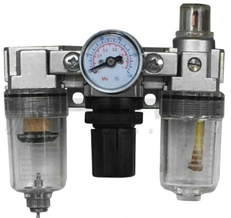
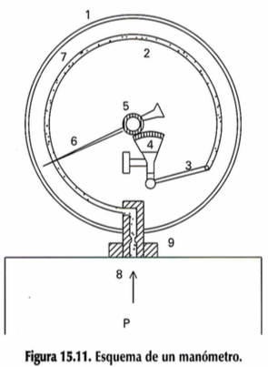
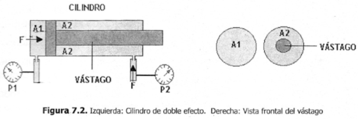
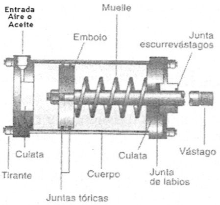
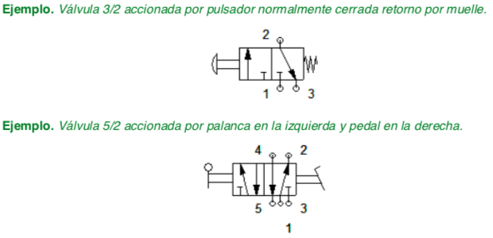
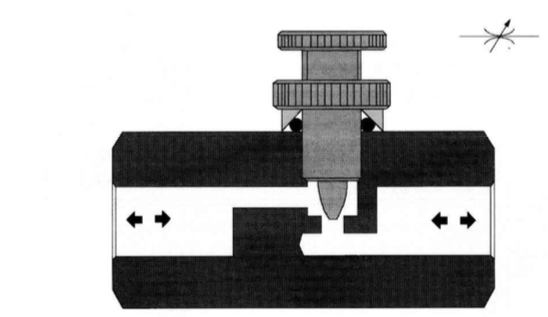
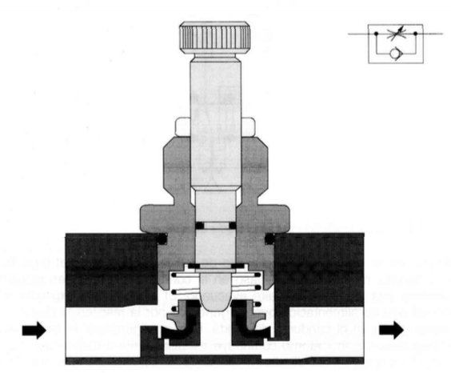
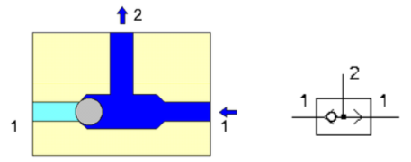
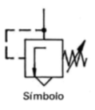

## Capítulo 2. Neumática

### Características del aire comprido

El aire, como todos los gases, es comprimible y comprensible; es decir, es elastico. Dentro de un recipiente con capacidad de 1 litro, es posible introducir varios litros de aire gracias a que se puede comprimir y al liberarlo, vuelve a su volumen normal.

Para comprimir el aire, se tiene que realizar un esfuerzo y será mayor cuanto mayor se quiera comprimir. Cuando el aire se libera a su estado normal, desarrolla una gran energía y es esta energía la que se utiliza para realizar los trabajos pesados.

El aire, como se sabe, es un gas casi perfectamente cartacterizándose esencialmente por su fluidez, compresibildiad y elasticidad. La fluidez permite a sus partículas no ofrecer resistencia apenas al deslizamiento; la compresibilidad (Fig. 1.1) hace que una determinada cantidad de gas pueda reducir su volumen si éste se encuentra en un recinto hermeticamente cerrado; la elasticidad permite que al comprimirlo en ese mismo recinto, ejerza sobre sus paredes una determinada presión, normal a las superficies en contacto (Fig. 1.2).

#### Unidades empleadas y equivalencias

$$1 atm = 14.7 psi =1,013 bar = 101.325kPa$$

$$ 1N/m^2 = 9.869 \times 10^{-6} atm = 10^{-5} bar$$

## Circuitos neumáticos

### Compresor

Los compresores son máquinas que se utilizan para comprimir el aire. El más elemental es el compresor alternativo, pero para aplicaciones industriales se cons_ truyen máquinas autónomas que utilizan un motor eléctrico y que se denominan electro compresores.

> Es el elemento de la instalación encargado de comprimir el aire que capta de la atmósfera elevando su presión.

Se compone de un cilindro y su culata con las correspondientes válvulas, una de admisión y otra de expulsión; un pistón provisto de segmentos para asegurar la compresión; una biela manivela (*conversión de un movimiento circular en rectilíneo alternativo*) y un cigüeñal. Todo montado en un cárter que, a su vez, hace de depósito para el aceite lubricante.

#### Tipos de compresores

Dependiendo del tipo de compresor que utilicemos distinguimos varios tipos.

- Compresores Volumétricos.
- Compresores Centrífugos.

##### Compresores Volumétricos

Dentro de este grupo destacan los compresores de pistón, que son los más difundidos. Se construyen de baja, media y alta presión, aunque en este caso deben disponer de varias eta­ pas compresoras.

###### Compresor de pistón de una sola etapa

La Figura 13.2 muestra un compresor de pistón clásico de
una sola etapa. El aire aspirado por el pistón en su carrera des­ cendente penetra en la cámara de compresión a través de la
válvula de admisión y después es inmediatamente comprimi­ do hasta la presión de trabajo, momento en el que se abre la válvula de escape. Durante el trabajo de compresión se gene­ ra calor -según previene la ley de Gay-Lussac- lo que obli­ga a una refrigeración del cilindro proporcional a la cantidad de calor producida. En los compresores pequeños bastan las aletas que lleva el cilindro por la parte exterior. En los mayo­ res se instala además un ventilador y en los de alta presión es necesaria la refrigeración por agua.

###### Compresor de pistón 2 etapas montaje en V

En la Figura 13.3 aparece un compresor de pistón de dos etapas y montaje en V. El aire comprimido en el primer pistón, después de refrigerado, se introduce en un segundo cilindro de volumen inferior que lo vuelve a comprimir. Así se obtienen presiones de 1 a 20 bar y con tres etapas se puede llegar hasta 220 bar.

##### Compresores Centrífugos

Se basan en aumentar la presión aprovechando la fuerza centrífuga. Para ello, lanzan el aire captado por el centro de una turbina hacia el exterior, donde lo recogen.
De este tipo son la mayoría de los extractores de aire que tienen las campanas extractoras de las cocinas.

### Tanque

Es un depósito de reserva de aire comprimido cuya misión es mantener el consumo de la red y evitar pérdidas de carga bruscas en la misma, en caso de fallo o accidente. En este ele­mento se elimina parte del agua  -que se condensa en su parte inferior- por medio de un orificio de purga.

Cumple varias funciones en una instalación de aire comprimido:

- Amortiguar las pulsaciones del caudal de salida de los compresores alternativos.
- Permitir que los motorores de arrastre de los compresores no tengan que trabajar de manera continua, sino intermitente.
- Hacer frente a las demandas punta de caudal sin que se provoquen caídas de presión en la red.

### Presostato (Switch de presión)

Si has observado los compresores no están funcionando continuamente. Esto es debido a que es posible acumular la energía neumática. El depósito se va a llenar hasta que alcance una determinada presión máxima, en ese momento el motor que acciona el compresor para. A medida que vamos consumiendo aire vamos extrayéndolo del depósito, con lo cual va bajando su presión. Al llegar a una presión mínima el compresor vuelve a arrancar para recuperar la presión perdida.
Vemos que el depósito varía entre un valor máximo y uno mínimo. El elemento que mide esas presiones y regula el funcionamiento del compresor es el presostato o manocontacto. **Básicamente es un interruptor regulado por presión**.

### Válvula de Seguridad

Si por alguna razón el presostato que regula el funcionamiento del compresor fallase, pueden ocurrir dos cosas.
Si falla el mecanismo que regula el arranque cuando baja la presión, el compresor no funcionaría, pero no pasaría nada más.
Si falla el mecanismo de paro cuando alcanza la presión de trabajo, el compresor continuaría aumentando la presión en el interior del depósito y éste podría estallar al no aguantar a presión.

### Válvula de purga

Debido a las presiones a las que es sometido el aire durante la compresión, parte del vapor de agua que contiene el aire puede licuar. Esta agua condensada se acumula en la parte inferior del depósito y periódicamente hay que purgarla para evitar que pase a la instalación.

### Unidad de Mantenimiento

Hasta ahora lo que hemos hecho ha sido comprimir el aire y almacenarlo para poder utilizarlo. El almacenamiento se realiza, como hemos visto, entre dos presiones determinadas. Estas variaciones perturbarían el funcionamiento de la instalación ya que funcionaría de manera distinta para cada presión. Es por ello que debemos realizar un acondicionamiento final que estabilice esa presión en un valor fijo. Este acondicionamiento es lo que hacemos en la unidad de mantenimiento.

*Para la utilización del aire comprimido, se requiere de un proceso de purificación, regulación y engrase*, que se logra mediante una unidad de mantenimiento, que debe ir montada en la entrada general de los circuitos neumáticos. Esta unidad tiene los siguientes objetivos:

- Eliminar el agua condensada arrastrada por el aire a lo largo de las tuberías hacia los elementos de trabajo y dispositivos de mando.
- Detener las partículas sólidas que contiene el aire comprimido en suspensión.
- Regular la presión de utilización del aire comprimido con el fin de lubricar los elementos neumáticos.

Así que la unidad de mantenimiento representa una combinación de los siguientes elementos:

- Filtro de aire comprimido
- Regulador de presión
- Lubricador de aire comprimido

#### Filtro

Su misión es retener las impurezas que pudiera contener el aire procedente del depósito y que podrían deteriorar la instalación posterior.
Está formado por un elemento filtrante, que puede
ser de papel, una chapa metálica taladrada o una malla de alambre, encargado de retener las impurezas. Aquí quedan retenidas las partículas de tamaño mayor que las de la malla.
El recipiente del filtro tiene también un diseño especial para que el aire en su recorrido realice un movimiento helicoidal que favorece que por efecto de las fuerzas centrífugas las gotas de agua y las partículas más grandes salgan proyectadas contra las paredes del filtro y sean recogidas en la parte inferior del filtro. Esta parte inferior del filtro es desmontable y periódicamente es necesario limpiarla.

#### Regulador de presión

Mantiene la presión en su salida constante independientemente de las variaciones de presión que haya en la entrada. La presión de salida tiene que ser siempre inferior a la presión mínima del depósito.
Como vemos en la imagen el aire pasa a través de un orificio y mediante una membrana vence la fuerza de un muelle, dependiendo de la presión la fuerza es mayor o menor mientras que la del muelle es constante. Esto provoca la mayor o menor apertura del orificio de paso, haciendo que la presión se mantenga constante aguas abajo.

#### Lubricador

Es el elemento que proporciona aceite para la lubricación de la instalación. Debido al efecto Venturi absorbe aceite de un depósito y lo pulveriza en el aire de trabajo. El aceite lo añadimos para reducir rozamientos en los elementos móviles de la instalación y proteger toda ella de la oxidación.
En este punto tendremos una caudal de aire a presión en condiciones de abastecer nuestra instalación a presión constante.

## Manómetro

Los manómetros son aparatos de control que sirven para medir la presión existente en un circuito en un momento dado.
La presión P del circuito tiende a rectificar el muelle tubular (2), el cual mueve el sector (4) que hace girar el piñón (5) unido a la aguja indicadora (6). En la escala (7) puede leerse entonces la presión registrada. La caña (10) del aparato lleva un estrangulador (8) que amortigua el impacto de la presión sobre la aguja.

## Elementos neumáticos

### Cilindro

*Los cilindros naumáticos son, por regla general, los elementos que realizan el trabajo. Su función es la de transformar la energóa neumática en trabajo mecánico de movimiento rectilíneo, que consta de carrera de avance y carrera de retroceso.*

De acuerdo a esta teoría física, si dentro del sistema se presenta una diferencia de áreas y la fuerza es igual en cualquier punto, entonces se tendrá una diferencia de presiones. Este principio se aplica en un dispositivo hidráulico denominado cilindro.

- Tubo de sección circular constante, cerrado por sus extremos
- En su interior se desliza un émbolo solidario con un vástago
- El émbolo divide al cilindro en dos volúmenes llamados cámaras
- Hay una abertura en cada cámara para que entre y salga el aire.

**Capacidad de trabajo:**

- **Carrera:** Desplazamiento que efectúa el émbolo en el interior del cilindro. De ella depende la **Longitud (L)** de desplazamiento del vástago.
  - En los cilindros se obtiene el máximo esfuerzo cuando la presión se ejerce sobre la cara del émbolo opuesta al vástago, ya que su superficie es mayor. En este caso el émbolo y el vástago realizan una CARRERA DE AVANCE.
  - Si la presión se ejerce sobre la cara del émbolo solidaria con el vástago, se origina una CARRERA DE RETROCESO.

- **Diámetro (D):** Determina la superficie del émbolo. Dada una determinada presión del aire, cuanto mayor sea la
superficie del émbolo, mayor será la fuerza que ejerce el vástago, ya que:

### Cilindro de simple efecto

**Estos cilindros tienen una sola conexión de aire.** No pueden realizar trabajos más que en un sentido. Entonces para que el vástago (o pistón) salga se aplica el aire y para que el vástago retorne se dispone de un muelle incorporado o de una fuerza externa.
El muelle incorporado se calcula de modo que haga regresar el émbolo a su posición inicial a una velocidad suficientemente grande.
En los cilindros de simple efecto con muelle incorporado, su longitud limita la carrera (el desplazamiento efectivo del vástago). Por eso, estos cilindros no sobrepasan una carrera de unos 100mm.
Se utilizan principalmente para sujetar, expulsar, apretar, levantar, alimentar, etc.
En la figura 8.1 se ilustra un esquema de la estructura interna, indicando las partes que lo componen. Como se observa en la figura, el fluido (aire o aceite) entra por la cámara izquierda y empuja al émbolo venciendo la resistencia del muelle haciendo que el vástago salga.

La figura 8.3 muestra el símbolo del cilindro de simple efecto. En la figura se tiene:

- (A) Cilindro de simple efecto con retorno por acción de fuerza externa
- (B) Cilindro de simple efecto con retorno por muelle
- (C) Inyecta fluido en la cámara izquierda del cilindro; las flechas indican que por efecto del fluido se ejerce una fuerza sobre el émbolo empujando el sistema hacia la derecha.

### Cilindro de doble efecto

*Son los más empleados y el fluido actúa en ambas cámaras*

La fuerza ejercida por el fluido en cilindros de doble efecto, permite que el vástago pueda realizar un movimiento de traslación en los dos sentidos. Se dispone de una fuerza útil tanto en la ida como en el retorno. La figura 8.4 muestra un esquema interno del cilindro. Para que el vástago se desplace en ambas direcciones es necesario que una de las cámaras esté alimentada y la otra esté en estado de escape (para el aire) o tanque (para el aceite)

Los cilindros de doble efecto comparados con los de simple efecto presentan algunas ventajas:

1. Pueden realizar esfuerzos en ambas cámaras.
2. Las carreras son mayores, pues se aprovecha prácticamente toda la longitud del cuerpo del cilindro.
3. No necesita de esfuerzo para comprimir un muelle por no tenerlo.
4. El retroceso del vástago no depende de las cargas o elementos mecánicos.
5. El funcionamiento y su posicionamiento se pueden ajustar con mayor precisión.

## Valvulas

Son muy similares para los circuitos neumáticos e hidráulicos. Están compuestos por válvulas distribuidoras encargadas de enviar el aire a presión a un lugar u otro por los diferentes conductos, o impedir su paso.
Todas las válvulas distribuidoras tienen un determinado número de conexiones que llamamos vías. A estas conexiones se conectan las tuberías de la red.
Cada válvula distribuidora tiene varias posiciones de funcionamiento, en función de las vías que conecte internamente.
Cada válvula viene caracterizada por esos dos números, y de esa forma la nombraremos:
No vías/no posiciones
Así una válvula 3/2, será una distribuidora con 3 vías y 2 posiciones.
Para representarla se hace en la posición de reposo por medio de un rectángulo dividido en tantos cuadrados como posiciones tenga la válvula, exteriormente se dibujan la vías en una de las posiciones y en cada cuadrado las conexiones entre vías.

### Accionamiento de las valvulas

### Valvulas distribuidoras

#### Conceptos de vías y posiciones

Las valvulas de vías se designan en los catálogos de los fabricantes por el número de las vías controladas y de las posiciones de maniobra estable. Así, una valvula 3/2 vías quier decir que posee tres vías y dos posiciones de maniobra. Hay que observar que la primera cifra es simplemente indicativa de número de vías, indicando la segunda el número de posiciones.

Para evitar errores durante el montaje y además para identificarlos, se indican con letras mayúsculas o números.

Según DIN 24300, se indica así:

P = Alimentaciónde aire comprimido.
A,B,C = Salida de trabajo.
R,S,T = Escape de aire.
X,Y,Z = Conexiones de mando.

Segun normas CETOP, es:

1 = Alimentación de aire comprimido
2 y 4 = Salidas de trabajo
3 y 5 = Escape de aire
12 y 14 = Conexiones de mando

### Valvula 2/2

Las válvulas 2/2 sirven para gobernar el paso del fluido. La denominación 2/2 significa que este elemento adopta dos posiciones -paso y cierre- y tiene dos vías, P y A.
La Figura 15.12, A) representa una de estas válvulas en reposo. En esta posición el paso de P hacia A está cerrado.
Cuando se acciona el pulsador, el distribuidor pone en comu­ nicación la entrada P con la utilización A (Figura 15.12, B);
entonces se dice que la válvula está abierta.

### Valvula 3/2

Estas válvulas permiten la circulación de aceite en una dirección y, al mismo tiempo, cortan el paso en la otra direc­ ción. Su símbolo aparece en la Figura 15.14.
Se emplean para gobernar cilindros de simple efecto.

### Valvula 4/2
### Valvula 5/2
### Valvula 4/3

### Válvula antirretorno o válvula Check

Permite el paso del fluido en un sentido, impidiendo su circulación en el opuesto.
Está constituida por un cierre presionado por un muelle. Sólo cuando la presión del aire es capaz de generar una fuerza que venza la ejercida por el muelle el fluido puede pasar.

### Válvula reguladora de caudal bidireccional o válvula de estrangulamiento

Mediante un estrechamiento en la red regulamos el caudal de fluido que pasa. Si el estrechamiento es regulable mediante un tornillo la regulación del caudal será variable.

### Válvula reguladora de caudal unidireccional o Válvula de estrangulamiento y antirretorno

La válvula de estrangulamiento y antiretorno reduce el caudal de aire solamente en un sentido. La valvula de anterretorni cierra el paso del aire en un sentido y el aire sólo puede pasar a través de la sección regulada. El aire puede pasar libremente en la dirección contraria a traves de la valvula de anterretorno abierta. Estas válvulas son utilizadas para regular la velocidad de cilindros neumáticos.

### Válvula selectora o válvula “OR” o válvula O

Tiene dos vías de entrada y una de salida.
Tenemos presión de salida si tenemos presión en una de las entradas o en la otra

### Válvula simultaniedad o válvula “AND” o válvula Y

Tiene dos vías de entrada y una de salida.
Tenemos presión de salida si tenemos presión en una de las entradas y en la otra simultáneamente.

### Valvula reguladora de presión

Las valvulas reguladoras de presión se encargan en un circuito de controlar la presión del fluido, desde un valor cero hasta el máximo que proporcione la red de distribución.

[Ejercicios 2](ejercicios2.html)

[Capítulo 1](index.html)
