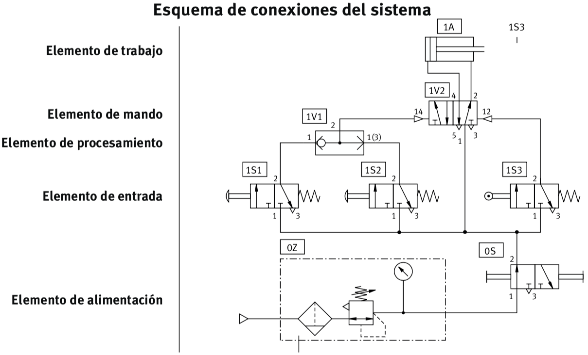

# Capítulo 4. Circuitos neumáticos

Para efectuar el montahe de los sistemas control, debe disponerse de un puesto de trabajo fijo. La alimentación de aire comprimido puede estar a cargo de un compresor móvil con silenciados (máximo 800kPa = 8 bar).

**La presión de funcionamiento deberá ser, como máximo, de p = 600kPa = 6 bar**

Para un funcionamiento óptimo, la presión de funcionamiento del sistema de control deberá ser máximo p=500kPa = 5 bar con aire sin lubricar.

## Estructura de una sistema neumático

### Esquema de conexiones del sistema

**Código de señalización de los componentes**

- Número del equipo empezando con 1; sólo se utiliza cuando el circuito de mando completo consta de más de un equipo.
- Número del circuito de mando comenzando con 1; todos los accesorios con 0.
- Señalización de los componentes por medio de letras
- Número de los componentes comenzando con 1

**Esquema de conexiones**

|Descripción|Nomenclatura|
|-|-|
|De arriba hacia abajo|
|Elemento de trabajo|1A
|Elemento de mando|1V2
|Elemento de procesamiento|1V1
|Elemento de entrada|1S1,1S2,1S3
|Elemento de alimentación|0Z,0S

## Nomenclatura

En el siguiente documento se detalla las diferentes nomenclaturas para el nombramiento de los elementos en un circuito neumático.

<embed src="cap4/identificaciones.pdf" width="80%" height="800px">

## Armando circuitos neumáticos

Armar los siguientes circuitos neumáticos para irse familiarizando con el software de simulación FluidSIM, conocer la hubicación de los elementos neumáticos y electricos. Configuración de válvulas y más elementos.

### Válvulas de control

### Válvulas combinacionales

[Capítulo 1](index.html)
[Capítulo 2](index2.html)
[Capítulo 3](index3.html)
[Ejercicios de circuitos neumáticos](circuitos.html)
